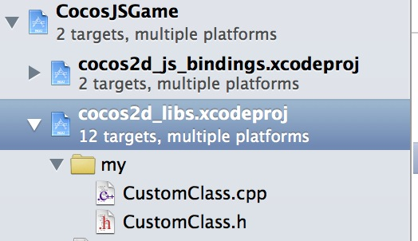
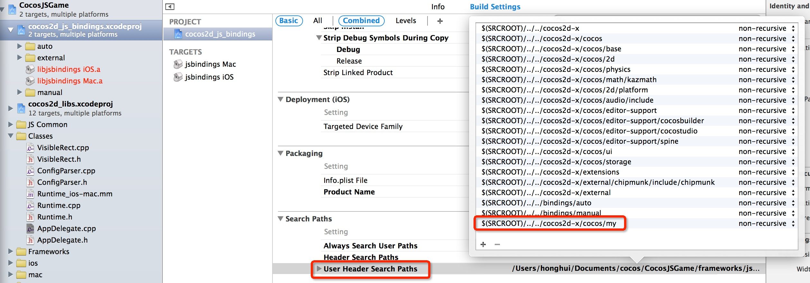

怎样把一个自定义的类绑定到js runtime
===
---

这个文档的目的是展示一下怎样把一个自定义的cpp类绑定到js runtime。**不涉及jsbinding的细节**。

所有平台的处理过程都是相似的，为了简化这个讲解，我们选择了Mac环境作为例子。

### 为runtime生成源码

假设在Cocos Code IDE中已经有了一个cocos-js的工程，命名为CocosJsGame.

* 源代码存放在\<projectLocation\>/frameworks/runtime-src目录下，如果这个路径已存在，跳过，下一步。
* 否则，你需要按以下步骤为runtime生成源代码:
  * 右键CocosJSGame项目
  * Cocos Tools->Add Native Codes Support...
  * 在**Create Native Source Wizard**中单击**Generate*
  * 现在已生成源代码

###在工程中添加自定义类


```
// CustomClass.h

#ifndef __CUSTOM__CLASS

#define __CUSTOM__CLASS

#include "cocos2d.h"

namespace cocos2d {
class CustomClass : public cocos2d::Ref
{
public:
    
    CustomClass();

    ~CustomClass();

    bool init();
    
    std::string helloMsg();

    CREATE_FUNC(CustomClass);
};
} //namespace cocos2d

#endif // __CUSTOM__CLASS

```

```
// CustomClass.cpp
#include "CustomClass.h"

USING_NS_CC;

CustomClass::CustomClass(){
    
}

CustomClass::~CustomClass(){
    
}

bool CustomClass::init(){
    return true;
}

std::string CustomClass::helloMsg() {
    return "Hello from CustomClass::sayHello";
}

```

打开**frameworks/runtime-src/proj.ios_mac/CocosJSGame.xcodeproj**, 添加CustomClass.h/CustomClass.cpp文件到cocos2d_libs.xcodeproj，要在底部选中**Cocos2d-x iOS**:


这时你能看到新的工程结构



在搜索路径中添加源文件路径



在搜索路径中添加绑定的文件路径


### 添加cocos2dx_custom.ini

打开`tools/tojs`文件夹，添加`cocos2dx_custom.ini`文件


这个文件的内容如下:

```
[cocos2dx_custom]
# the prefix to be added to the generated functions. You might or might not use this in your own
# templates
prefix = cocos2dx_custom

# create a target namespace (in javascript, this would create some code like the equiv. to `ns = ns || {}`)
# all classes will be embedded in that namespace
target_namespace = cc

android_headers = -I%(androidndkdir)s/platforms/android-14/arch-arm/usr/include -I%(androidndkdir)s/sources/cxx-stl/gnu-libstdc++/4.7/libs/armeabi-v7a/include -I%(androidndkdir)s/sources/cxx-stl/gnu-libstdc++/4.7/include
android_flags = -D_SIZE_T_DEFINED_ 

clang_headers = -I%(clangllvmdir)s/lib/clang/3.3/include 
clang_flags = -nostdinc -x c++ -std=c++11

cocos_headers = -I%(cocosdir)s/cocos -I%(cocosdir)s/my -I%(cocosdir)s/cocos/base -I%(cocosdir)s/cocos/platform/android
cocos_flags = -DANDROID -DCOCOS2D_JAVASCRIPT

cxxgenerator_headers = 

# extra arguments for clang
extra_arguments = %(android_headers)s %(clang_headers)s %(cxxgenerator_headers)s %(cocos_headers)s %(android_flags)s %(clang_flags)s %(cocos_flags)s %(extra_flags)s 

# what headers to parse
headers = %(cocosdir)s/cocos/my/CustomClass.h

# what classes to produce code for. You can use regular expressions here. When testing the regular
# expression, it will be enclosed in "^$", like this: "^Menu*$".
classes = CustomClass.*

# what should we skip? in the format ClassName::[function function]
# ClassName is a regular expression, but will be used like this: "^ClassName$" functions are also
# regular expressions, they will not be surrounded by "^$". If you want to skip a whole class, just
# add a single "*" as functions. See bellow for several examples. A special class name is "*", which
# will apply to all class names. This is a convenience wildcard to be able to skip similar named
# functions from all classes.

skip = 

rename_functions = 

rename_classes = 

# for all class names, should we remove something when registering in the target VM?
remove_prefix = 

# classes for which there will be no "parent" lookup
classes_have_no_parents = 

# base classes which will be skipped when their sub-classes found them.
base_classes_to_skip = Ref Clonable

# classes that create no constructor
# Set is special and we will use a hand-written constructor
abstract_classes = 

# Determining whether to use script object(js object) to control the lifecycle of native(cpp) object or the other way around. Supported values are 'yes' or 'no'.
script_control_cpp = no
```

### 更改tools/tojs/genbindings.py

找到`custom_cmd_args`(老版本中(包括版本Cocos2d-js 3.0 alpha 2)只有`cmd_args`)在tools/tojs/genbindings.py并增加一行 :

```
  'cocos2dx_custom.ini' : ('cocos2dx_custom', 'jsb_cocos2dx_custom'), \
```


### 运行tools/tojs/genbindings.py

运行tools/tojs/genbindings.py，这时你会发现`jsb_cocos2dx_custom.cpp`和 `jsb_cocos2dx_custom.h`在frameworks/custom/auto文件夹里(如果是`cmd_args`，是在frameworks/js-bindings/bindings/auto里)


把他们加到Xcode工程里


### 注册到js

打开`jsb_cocos2dx_custom.hpp`，这儿有一个全局函数声明

`register_all_cocos2dx_custom(JSContext* cx, JSObject* obj);`

在自定义类访问之前先访问这个函数，例如在AppDelegate.cpp 里，在运行JavaScript入口文件之前:

```
    ...
    #include "jsb_cocos2dx_custom.hpp"
    ...
    
	sc->addRegisterCallback(register_all_cocos2dx_custom);
    
#if (COCOS2D_DEBUG>0)
    if (startRuntime())
        return true;
#endif

    ScriptingCore::getInstance()->start();
    auto engine = ScriptingCore::getInstance();
    ScriptEngineManager::getInstance()->setScriptEngine(engine);
    ScriptingCore::getInstance()->runScript(ConfigParser::getInstance()->getEntryFile().c_str());   
```

### 建立runtime
在Cocos Code IDE中:

 * 右键CocosJSGame项目
 * Cocos Tools->Build Runtime...
 * 选择目标平台然后选择**build**
 

### 在js中使用自定义类

在你想用自定义类的地方编辑main.js

```
	var customClass = cc.CustomClass.create();
    var msg = customClass.helloMsg()
    cc.log("customClass's msg is : " + msg)
```

### 测试

用新的环境`CocosJSGame`运行/调试这个工程，在控制台中将会看到如下的log：

`customClass's msg is : Hello from CustomClass::sayHello`


