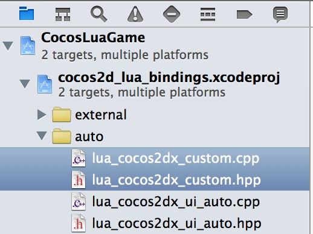

LUA 런타임에 C++ 커스텀 클래스를 바인딩하는 법
===
---

이 문서는 루아 런타임에 커스텀 CPP 클래스를 바인딩하는 법을 보여줍니다. ** 루아 바인딩의 세부 사항에 대한 내용이 아닙니다**.

맥 런타임을 선택해서 예제를 진행하지만 모든 플랫폼에서 유사하게 진행됩니다.

### 런타임을 위한 소스 코드 만들기
Cocos Code IDE 내부에 CocosLuaGame이라는 Cocos2d Lua 프로젝트를 만듭니다.

* 런타임의 소스코드는 \<프로젝트의 위치\>/frameworks/runtime-src에 위치하며, 이미 해당 디렉토리가 존재하면 다음 내용은 건너뛰셔도 좋습니다.
* 그렇지 않으면, 런타임을 위한 소스 코드를 다음의 절차에 따라 생성하셔야 합니다:
  * CocosLuaGame를 우클릭
  * Cocos Tools->Add Native Codes Support...
  * **Generate**의 **Create Native Source Wizard** 클릭
  * 그러면 소스 코드가 생성될 것입니다

### 프로젝트에 CustomClass 클래스 추가하기


```

// CustomClass.h

#ifndef __CUSTOM__CLASS

#define __CUSTOM__CLASS

#include "cocos2d.h"

namespace cocos2d {
class CustomClass : public cocos2d::Ref
{
public:
    
    CustomClass();

    ~CustomClass();

    bool init();
    
    std::string helloMsg();

    CREATE_FUNC(CustomClass);
};
} //namespace cocos2d

#endif // __CUSTOM__CLASS

```

```
// CustomClass.cpp
#include "CustomClass.h"

USING_NS_CC;

CustomClass::CustomClass(){
    
}

CustomClass::~CustomClass(){
    
}

bool CustomClass::init(){
    return true;
}

std::string CustomClass::helloMsg() {
    return "Hello from CustomClass::sayHello";
}

```

**frameworks/runtime-src/proj.ios_mac/CocosLuaGame.xcodeproj**를 열고, cocos2d_libs.xcodeproj에 CustomClass.h/CustomClass.cpp를 추가합니다. 꼭 아래처럼 **cocos2dx Mac**를 체크합니다:


그러면 다음과 같은 새로운 프로젝트 구조를 볼 수 있습니다:


검색 경로를 추가합니다:


### cocos2dx_custom.ini 추가하기

`tools/tolua` 디렉토리를 열고 `cocos2dx_custom.ini` 파일을 추가합니다:


파일의 내용은 아래와 같은데 `target_namespace`은 공백으로 놔둡니다, 그 이유는 임베디드 커스텀 클래스에서 네임스페이스 코드 자동 완성을 Cocos Code IDE에서 아직 지원하지 않기 때문입니다:

```
[cocos2dx_custom]
# the prefix to be added to the generated functions. You might or might not use this in your own
# templates
prefix = cocos2dx_custom

# create a target namespace (in javascript, this would create some code like the equiv. to `ns = ns || {}`)
# all classes will be embedded in that namespace
target_namespace =

android_headers = -I%(androidndkdir)s/platforms/android-14/arch-arm/usr/include -I%(androidndkdir)s/sources/cxx-stl/gnu-libstdc++/4.7/libs/armeabi-v7a/include -I%(androidndkdir)s/sources/cxx-stl/gnu-libstdc++/4.7/include
android_flags = -D_SIZE_T_DEFINED_ 

clang_headers = -I%(clangllvmdir)s/lib/clang/3.3/include 
clang_flags = -nostdinc -x c++ -std=c++11

cocos_headers = -I%(cocosdir)s/cocos -I%(cocosdir)s/my -I%(cocosdir)s/cocos/base -I%(cocosdir)s/cocos/platform/android
cocos_flags = -DANDROID

cxxgenerator_headers = 

# extra arguments for clang
extra_arguments = %(android_headers)s %(clang_headers)s %(cxxgenerator_headers)s %(cocos_headers)s %(android_flags)s %(clang_flags)s %(cocos_flags)s %(extra_flags)s 

# what headers to parse
headers = %(cocosdir)s/cocos/my/CustomClass.h

# what classes to produce code for. You can use regular expressions here. When testing the regular
# expression, it will be enclosed in "^$", like this: "^Menu*$".
classes = CustomClass.*

# what should we skip? in the format ClassName::[function function]
# ClassName is a regular expression, but will be used like this: "^ClassName$" functions are also
# regular expressions, they will not be surrounded by "^$". If you want to skip a whole class, just
# add a single "*" as functions. See bellow for several examples. A special class name is "*", which
# will apply to all class names. This is a convenience wildcard to be able to skip similar named
# functions from all classes.

skip = 

rename_functions = 

rename_classes = 

# for all class names, should we remove something when registering in the target VM?
remove_prefix = 

# classes for which there will be no "parent" lookup
classes_have_no_parents = 

# base classes which will be skipped when their sub-classes found them.
base_classes_to_skip = 

# classes that create no constructor
# Set is special and we will use a hand-written constructor
abstract_classes = 

# Determining whether to use script object(js object) to control the lifecycle of native(cpp) object or the other way around. Supported values are 'yes' or 'no'.
script_control_cpp = no

```

### tools/tolua/genbindings.py 수정하기

tools/tolua/genbindings.py에서 `cmd_args`를 찾아서 아래의 라인을 추가합니다:

```
  'cocos2dx_custom.ini' : ('cocos2dx_custom', 'lua_cocos2dx_custom'), \
```


### tools/tolua/genbindings.py 실행하기

tools/tolua/genbindings.py를 실행하면 cocos/scripting/lua-bindings/auto의 `lua_cocos2dx_custom.h`와 `lua_cocos2dx_custom.cpp`, cocos/scripting/lua-bindings/auto/api의 `CustomClass.lua`를 찾을 수 있습니다:


Xcode 프로젝트에 해당 파일들을 추가합니다:



### 루아에 해당 파일들을 등록

`lua_cocos2dx_custom.h`를 열어서 다음과 같은 전역 함수를 선언합니다 --> `register_all_cocos2dx_custom(lua_State* tolua_S);`

루아 진입 파일을 실행하기 전에 예제처럼 AppDelegate.cpp의 CustomClass가 사용되기 전에 위의 함수를 호출합니다:

```
    ...
    #include "lua_cocos2dx_custom.hpp"
    ...
    
	// register custom function
    LuaStack* stack = engine->getLuaStack();
    auto state = stack->getLuaState();
    lua_getglobal(state, "_G");
    register_all_cocos2dx_custom(state);
    lua_pop(state, 1);
    
#if (COCOS2D_DEBUG>0)
    if (startRuntime())
        return true;
#endif

    engine->executeScriptFile(ConfigParser::getInstance()->getEntryFile().c_str());
    return true;        
```

### 런타임 빌드
Cocos Code IDE에서:

 * CocosLuaGame project 우클릭
 * Cocos Tools->Build Runtime...
 * 대상 플랫폼을 선택하고 **build** 클릭
 
### Cocos Code IDE(1.0.1.beta 또는 상위 버전)에 CustomClass 자동 완성 추가
`CustomClass.lua`를 CustomClass.zip과 같은 zip 파일로 만들기 위해 다음의 커맨드를 입력합니다:

```
zip CustomClass.zip CustomClass.lua
```

Cocos Code IDE에서:

* CocosLuaGame 프로젝트 우클릭
* Build Path->Configure Build Path...->Libraries->Add ZIPS...
* 
* `CustomClass.zip`를 선택하고 **OK** 클릭

### 루아에서 CustomClass 사용하기
main.lua를 수정해서 CustomClass를 사용해봅시다:

```
	local customClass = CustomClass:create()
    local msg = customClass:helloMsg()
    cclog("customClass's msg is : " .. msg)
```

### 테스트
`CocosLuaGame` 프로젝트를 실행해보면 콘솔에서 다음과 같은 로그 메시지를 볼 수 있습니다:

`customClass's msg is : Hello from CustomClass::sayHello`


