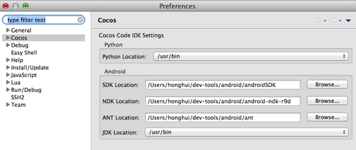
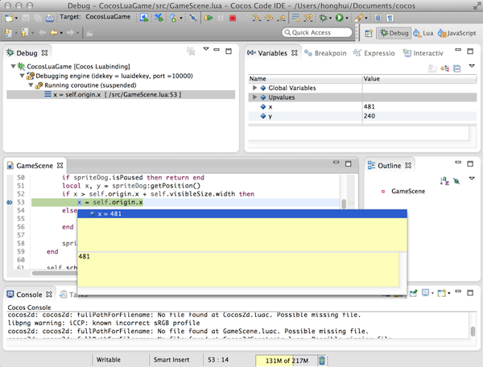

使用Code IDE调试Cocos2d-x Lua游戏
===
---
支持的调试环境：

在 Windows 上你可以调试Windows和Android游戏，在 Mac 上你可以调试Mac、iOS和Android游戏。我们以 Mac 作为开发环境来演示 Code IDE 的使用，Windows上的流程和这里所介绍的几乎一样，不再赘述。

先决条件
===
---
如果你还没有安装好 Cocos Code IDE，请先参考[Code IDE 入门指南](../getting-started/zh.md)

IDE 配置
===
---
## 基础设置
打开工具的 **Preferences** 页，切换到 **Cocos/Lua** 子页面，选择你刚刚下载的 Cocos2d-x 3.x 作为 Lua Framework。

+ 

## 额外设置
假设你发现我们提供给你的预编译的Android runtime不能满足你的要求，你就需要重新定制，那么你就需要提供给 IDE 几个 Android 编译需要用到的工具。这可以通过打开 **Preferences/Cocos** 页面进行配置。

+ 

运行、测试游戏
===
---
1. 新建一个名为 CocosLuaGame 的 Cocos Lua 工程
2. 点击工具栏上的 debug 按钮
+ 
3. 默认情况下脚本会运行在我们提供的 mac 版本预编译 runtime 上。为了简单起见，我们不对默认值进行任何改动。如果你想要在其他我们支持的目标平台上调试程序，可参考**在其它目标平台上调试**

如何调试
===
---
## 断点支持
+ 可以在 lua 脚本文件中增加断点
+ 当断点被触发时选择 "Yes" 打开 **Debug Perspective** 透视图，可以看到很多与调试相关的视图，调用栈、变量和断点等等
+ 
+ 支持 **Step over, Step into, Step out** 等调试方式

## 代码热更新
对 spriteDog 的移动路线很不爽？tick() 函数是控制每一帧 spriteDog 位置的。

```lua
-- moving dog at every frame
local function tick()
    if spriteDog.isPaused then return end
    local x, y = spriteDog:getPosition()
    if x > origin.x + visibleSize.width then
        x = origin.x
    else
        x = x + 1
    end

    spriteDog:setPositionX(x)
end    
```
修改这个函数的实现，比如将 x = x + 1 修改为 x = x + 10，之后保存。
你会发现，在没有重启 runtime 的情况下 spriteDog 的移动速度改变了

## 在其它目标平台上调试
+ 通过工具栏上的打开 Debug Configurations 打开 Debug Configurations 页面
+ 
+ 在页面的左侧，选择之前我们为你创建的名为CocosLuaGame的configuration

### 在 iOS Simulator 上调试
+ 选择 **iOS Simulator** 单选项
+ 选择正确的 runtime app
+ 
+  点击 **Debug** 按钮，预编译的 runtime 会被自动安装到模拟器中

### 在 iOS 设备上调试
+ 首先，你需要一个 runtime IPA， 从 1.0.0-rc1 版本开始，你可以通过 Code IDE 自己编译一个，然后[安装IPA到设备中][How To Install IPA]
+ 在 iOS 设备上启动 runtime
+ 在 "Debug Configuration" 界面选择 **Remote Debug** 单选项
+ platform 选择 "iOS"
+ 将设备的 ip 地址填写在 **Device IP** 上并在**Host IP**上选择 mac 机器使用的 ip 地址， 请确保设备ip和mac机器的ip能相互访问
+ 
+ 最后点击 **Debug** 按钮 

### 在 android 设备上使用 ADB 模式调试 
+ 在 "Debug Configuration" 界面选择 **Android ADB Mode** 单选项
+ 选择正确的 runtime apk
+ 
+ 点击 **Debug** 按钮
+ IDE 会自动安装配置中的 runtime apk 到你的连接设备上并启动runtime开始调试

### 在 android 设备上使用网络模式调试
+ 手动安装 runtime 到你的设备上，它被存放在 CocosLuaGame/runtime/android 目录中
+ 手动启动 runtime，停留在 waiting 页面
+ 在 "Debug Configuration" 界面选择 **Remote Debug** 单选项
+ platform 选择 "Android"
+ 将设备的 ip 地址填写在 **Device IP** 上并在**Host IP**上选择 mac 机器使用的 ip 地址， 请确保设备ip和mac机器的ip能相互访问
+ 
+ 点击 **Debug** 按钮

### 如何调试 C++ 代码
从 1.0.0-rc1 版本开始，支持使用 XCode/Visual Studio 调试 C++ 代码的同时使用 Cocos Code IDE 调试 C++ 代码。

以调试 Mac 为例：

+ 如果你还没有 C++ 代码，那么需要先添加（右击工程，Cocos Tools->Add Native Codes Support...）
+ 使用 XCode 打开 `frameworks/runtime-src/proj.ios_mac` 工程，并启动调试
+ 回到 Cocos Code IDE，打开 "Debug Configuration" 页面，选择 **Remote Debug** 单选项
+ platfrom 选择 “Mac”
+ **Target IP** 填写 "127.0.0.1"
+ **Host IP** 选择 "127.0.0.1"
+ 
+ 点击 **Debug** 按钮

[How To Install IPA]:http://www.solutionanalysts.com/blog/how-install-ipa-file-iphone-ipod-ipad-using-itunes-mac-windows