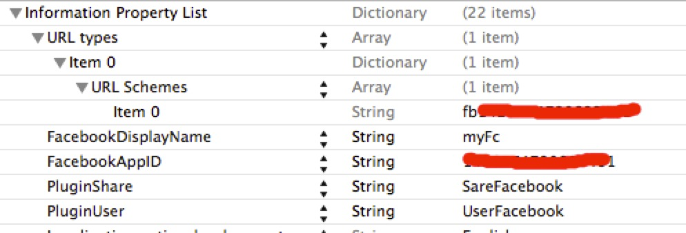

#iOS平台上如何集成Facebook SDK Beta for Cocos2d-JS

这篇文当将展示如何在iOS中快速的使用Facebook SDK Beta for Cocos2d-JS。
 
**注意**: Facebook SDK Beta for Cocos2d-JS需要配合Cocos2d-JS v3.0 RC2及以上版本使用。

## 创建你的Facebook应用

Facebook SDK Beta for Cocos2d-JS在iOS平台上使用Facebook iOS SDK作为其基础，你需要先参考[Facebook官方文档](https://developers.facebook.com/docs/ios/getting-started/)来创建应用并配置iOS开发环境。

## 在工程中配置Facebook iOS SDK（同样参考Facebook官方文档）

打开我们创建好的iOS工程（我们假设我们新建的工程叫做myProject，下同），我们可以在`myProject/frameworks/runtime-src/proj.ios_mac/`路径下找到我们新建的iOS工程。

1. 添加Facebook iOS SDK：我们需要将`myProject/frameworks/js-bindings/cocos2d-x/plugin/plugins/proj.ios/sdk/`路径下的FacebookSDK.framework加入到`Link Binary With Libraries`中：点击工程，`target`->`myProject IOS`->`Build Phases`->`Link Binary With Libraries`。点击`+`将FacebookSDK.framework加入其中。

2. 按照Facebook官方文档的要求，在Xcode工程下ios的Info.plist文件中添加你的Facebook应用的`FacebookAppID` `FacebookDisplayName` `URL types`，具体格式参考图片。<br/><br/>


3. 在Info.plist中添加`PluginShare`->`ShareFacebook`与`PluginUser`->`UserFacebook`两个条目，效果参考上图。

4. 找到`ios/AppController.mm`，并在当中加入Facebook iOS SDK需要的代码：

- 引入Facebook的头文件 `FacebookSDK/FacebookSDK.h`，

	```
	#import <FacebookSDK/FacebookSDK.h>
	```

- 在`AppController.mm`添加如下方法

	```
	- (BOOL)application:(UIApplication *)application openURL:(NSURL *)url sourceApplication:(NSString *)sourceApplication annotation:(id)annotation
	{
	    return [FBSession.activeSession handleOpenURL:url];
	}
	```

- 在`applicationDidBecomeActive:`方法中添加入 `[FBAppCall handleDidBecomeActive];`

	```
	- (void)applicationDidBecomeActive:(UIApplication *)application {
	    [FBAppCall handleDidBecomeActive];
	    cocos2d::Director::getInstance()->resume();
	}
	```

## 在工程中添加Plugin-x和PluginFacebook的工程

因为`Facebook SDK Beta for Cocos2d-JS`对Plugin-x的依赖，我们首先需要添加Plugin-x的工程：

1. 将PluginProtocol的Xcode工程（`myProject/frameworks/js-bindings/cocos2d-x/plugin/protocols/proj.ios`）添加到你的游戏工程中，右击myProject工程，点击`addFiles to "myProject"`或者直接拖拽PluginProtocol的工程到"myProject"下。

2. 将PluginFacebook的Xcode工程（`myProject/frameworks/js-bindings/cocos2d-x/plugin/plugins/facebook/proj.ios`路径下）引入到工程中，右击myProject工程，点击`addFiles to "myProject"`或者直接拖拽PluginFacebook的工程到"myProject"下。

3. 将库文件添加到的Build Phases：点击工程，`target`->`myProject IOS`->`Build Phases`，在`Link Binary With Libraries`中添加`libPluginProtocol.a`和 `libPluginFacebook.a`。

## 添加Plugin-x的JSB绑定代码

在上面这些步骤之后，我们现在就可以使用FacebookAgent类了，它包装了所有Facebook SDK Beta的C++层API。为了这些API能够在Javascript层暴露出来，还有几个步骤要做，我们需要在工程中包含Javascript绑定代码并将绑定代码注册到SpiderMonkey中。

1. 添加jsb_pluginx.js (`myProject/frameworks/js-bindings/cocos2d-x/plugin/jsbindings/script`目录下) 到`myProject`工程中，并确保它在`Build Phases`的`Copy Bundle Resources`列表中.

2. 找到Classes文件夹，并在`AppDelegate.cpp`文件中加入与Plugin-x相关的头文件，在此我们需要加入两个头文件，`jsb_cocos2dx_pluginx_auto.hpp`和`jsb_pluginx_extension_registration.h` 代码如下所示：

    ```
	#if (CC_TARGET_PLATFORM == CC_PLATFORM_IOS || CC_TARGET_PLATFORM == CC_PLATFORM_ANDROID)
		#include "jsb_cocos2dx_pluginx_auto.hpp"
		#include "jsb_pluginx_extension_registration.h"
	#endif
    ```

3. 同样的，在`AppDelegate.cpp`的`AppDelegate::applicationDidFinishLaunching`函数中添加绑定函数的注册，如下所示

    ```
	#if (CC_TARGET_PLATFORM == CC_PLATFORM_IOS || CC_TARGET_PLATFORM == CC_PLATFORM_ANDROID)
		sc->addRegisterCallback(register_all_pluginx_protocols);
		sc->addRegisterCallback(register_pluginx_js_extensions);
	#endif
    ```

自此，我们的Plugin-x工程引入就做完了，如果你想了解更多Plugin-x的配置，请参考[Plugin-x架构](http://www.cocos2d-x.org/docs/manual/framework/html5/jsb/plugin-x/plugin-x-architecture/zh)和[如何使用Plugin-x iOS篇](link)。

## 如何使用Facebook SDK Beta

- 如何使用Facebook API 请参考 [Facebook SDK Beta for Cocos2d-JS](../api-reference/zh.md)