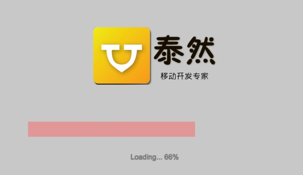

#如何自定义 Cocos2d-html5 Loading 界面
---

在使用 C++ 编写 Cocos2d-x 游戏的时候，通常在运行游戏之前，需要加载游戏资源，这样是为了让游戏在运行时更为流畅，避免了在运行时加载资源，而出现卡顿现象，影响用户体验，因为加载资源是非常耗时、耗资源的操作。在 Cocos2d-html5 中也是同样，在运行游戏之前，预先加载好所有的资源（加载到浏览器缓存），以保证游戏的流畅运行。

##Cocos2d-html5 的加载流程
在开始我们的替换工作之前，大致说一下必要的（只注重我们在乎的细节问题）原有的加载流程，以**HelloHTML5World**为例 。从其主页面 **index.html**开始，我们需要了解三个文件的运作方式，index.html、cocos2d.js 和 main.js：

浏览器首先加载 index.html 页面，值得注意的有两点，在页面的 DOM 树中，能看到命名为**gamecanvas**的**Canvas**元素，它将会是游戏的画布，另一点，在页面的最后，加载了 **cocos2d.js** 文件。

cocos2d.js 内中，定义了程序运行需要的一些参数，如 显示 FPS，是否加载扩展库，物理引擎库等，其中 **engineDir** 设置了引擎所在的位置，appFiles 设置了，当前项目所用到需要加载的 js 程序代码。并定义了当 DOM 加载完成时运行的代码(你可以在 [【这里】](https://github.com/iTyran/Tutorials/blob/master/html5/CustomLoading/src/Loading.js) 查看所有代码。)：

	window.addEventListener('DOMContentLoaded', function () {
	    // 添加脚本
	    var s = d.createElement('script');
	    // 这里判断了是否使用自定义的 单文件作为库加载，对库的优化压缩文件
	    if (c.SingleEngineFile && !c.engineDir) {
	        s.src = c.SingleEngineFile;
	    }
	    else if (c.engineDir && !c.SingleEngineFile) {
	 
	        s.src = c.engineDir + 'platform/jsloader.js';
	    }
	    else {
	        alert('You must specify either the single engine file OR the engine directory in "cocos2d.js"');
	    }
	    document.ccConfig = c;
	    s.id = 'cocos2d-html5';
	    // 将脚本加载到当前文档，地址是  jsloader.js 的实际地址
	    d.body.appendChild(s);
	});

jsloader.js 里面设置了一堆需要加载的可执行脚本，保存在 engine 变量之中，在文件的最后，我们能够看到这样的代码：

	// 将所有的 appFiles 添加到 engine 中，返回到新定义的变量 que 之中
	var que = engine.concat(c.appFiles);
	que.push('main.js');
	...
	// 后面一个 for 循环，添加所有文件到 document 中去

由以上代码，便将我们自定义的使用脚本和 main.js 添加进去了，而最后执行的也是 main.js 脚本，游戏的第一个运行场景就由此开始。main.js 里面创建了一个 cocos2dApp 的类型，它 继承(虽然在 js 中没有继承的概念，但有类似于继承的机制) 自 **cc.Applicatoin**，其中我们看到非常熟悉的函数 **applicationDidFinishLaunching** ，有这样一段代码：

	// 调用 cc.LoaderScene Loading 界面，用以加载资源
	cc.LoaderScene.preload(g_resources, function () {
	    // 当资源加载完毕，回调函数，运行第一个场景，而这个场景是由 cocos2dApp 的构造函数传入
	    director.replaceScene(new this.startScene());
	}, this);
	 
	// main.js 最后一行
	var myApp = new cocos2dApp(GameLayer.scene);

在 cocos2dApp 的构造函数中，初始化了一些必要信息，并调用了`cc.AppController.shareAppController().didFinishLaunchingWithOptions();`，这会间接的调用 Application 的 run 方法，从而导致`applicationDidFinishLaunching `方法被触发。它运行了`cc.LoaderScene`的 preLoad 方法，这内中就是 Loading 界面的实现了，它传入了一个回调函数，用于确定在资源加载完毕之后启动第一个场景（Loading 其本身也是一个场景）。

##怎样自定义 Loading 界面
前面我们了解了 Cocos2d-html5 的大致加载流程，而现在我们关注的是 **cc.LoaderScene** 所在的文件 CCLoader.js 的内部实现。里面定义了 **cc.Loader** 和 **cc.LoaderScene** 类型，Loader 内部完成了，对资源加载的所有操作步骤实现，而 LoaderScene 则是对 Loader 的进一步封装，将加载的过程，用一个界面来可视化的实现出，如用一个加载场景，上面一个 Logo 显示，同事显示了当前加载资源的进度百分比。我们要自定义实现 **Loading** 界面，那就是重新实现 LoaderScene 即可。对于 LoaderScene 的实现比较简单，我们参考其实现，自定义一个 Loader.js 文件，实现 Loader 类，完成自定义Loading 界面的具体实现，其中大多参考（实际是copy）了 LoaderScene 的实现，在其上修改扩充，它完成了修改 Logo 图片，并添加了一个简单的精度条，是加载过程更为一目了然，这里并没有多么炫的效果，但足以让你了解，你该如何自定义一个 Loading 界面（只贴出了相比较 LoaderScene 所修改的部分，但你可以在 [【这里】](https://github.com/iTyran/Tutorials/blob/master/html5/CustomLoading/src/Loading.js) 获取到源码）：

	// 这里定义了 Logo 图片的 Base64 编码，至于为什么，后面将会说明，这里的编码内容挺多，固做简写
	logoData = "data:image/png;base64,...";
	 
	Loading = cc.Scene.extend(
	    _logo: null,
	    _logoTexture: null,
	    _texture2d: null,
	    _bgLayer: null,
	    _label: null,
	    _winSize:null,
	    _processLayer: null,    // 相比 LoaderScene  的实现，添加了两个属性，标示进度条层和进度条长度
	    _processLayerLength: null,
	 
	    // 构造函数
	    ctor: function () {
	        this._super();
	        this._winSize = cc.Director.getInstance().getWinSize();
	    },
	    init:function(){
	        cc.Scene.prototype.init.call(this);
	 
	        // logo 图片和 label 的添加 .. 这里省略，于 LoaderScene 同样
	 
	        // 设置进度条层，它就是一个红色颜色层，通过长度来标示加载的进度
	        this._processLayerLength = 500;
	        this._processLayer = cc.LayerColor.create(cc.c4b(255, 100, 100, 128), 1, 30);
	        this._processLayer.setPosition(cc.pAdd(centerPos, cc.p(- this._processLayerLength / 2, -logoHeight / 2 - 50)));
	        // 可以启用锚点，并设置以满足自己的需要
	        // this._processLayer.ignoreAnchorPointForPosition(false);
	        // this._processLayer.setAnchorPoint(cc.p(0, 0));
	 
	        this._bgLayer.addChild(this._processLayer);
	    },
	    // 以下方法的实现并没有跟 LoaderScene 有什么不同
	    // _initStage: ...
	    // onEnter ...
	    // onExit ...
	    // initWithResources ...
	    // _startLoading ...
	    // _logoFadeIn
	    // 每帧更新
	    _updatePercent: function () {
	        var percent = cc.Loader.getInstance().getPercentage();
	        var tmpStr = "Loading... " + percent + "%";
	        this._label.setString(tmpStr);
	 
	        // 设置当前进度条层的长度
	        this._processLayer.changeWidth(this._processLayerLength * percent / 100);
	 
	        if (percent >= 100)
	            this.unschedule(this._updatePercent);
	    }
	});
	// 这里于 LoaderScene 的实现同样
	Loading.preload = function (resources, selector, target) {
	    if (!this._instance) {
	        // 创建一个 Loading
	        this._instance = new Loading();
	        this._instance.init();
	    }
	    // ...
	    return this._instance;
	};

这里我们只是 copy 了一份 LoaderScene（copy 修改会让这里的操作步骤简化） ，重新命名 Loading 然后在此基础添加了一个进度条显示，当然这里的 Loading 类完全由你自己定义，它有哪些显示，你可以随意定制，只要在 **_updatePercent** 方法实时获取当前进度，并且更新到界面显示即可。

我们注意到在 Loading 文件，定义了一个 logoData 变量，它保存的是一张图片的 Base64 位格式编码，这样做的好处是，在运行显示图片之时，不会出现此图没有加载的情况，但是也由于它是 Base64 编码的图片，所以图片不宜过大，否则编码后的数据量很大，其次解码也需要耗时。

完成 Loading.js 后，我们需要加载它，并让它运行，以替换 LoaderScene 的运行。首先修改项目 cocos2d.js 文件，在**appFiles**添加 **Loading.js** 文件。其次修改 main.js 文件内 **cc.LoaderScene.preload** 为 **Loading.preload** 即可，刷新 index.html 界面，将能看见 Loading 界面已经替换。它加载速度的快慢取决于游戏资源内容的多少 ~

