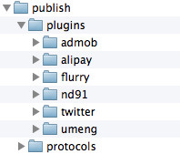
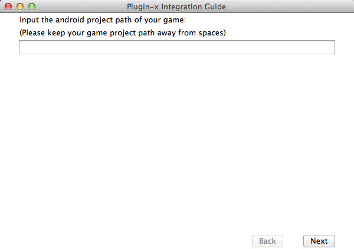

#How to use plugin-x in android

##environment requirement
- python 2.7 [http://www.python.org](http://www.python.org)
- Ant [http://ant.apache.org](http://ant.apache.org)
- Cygwin (if you work on windows)

##compile the plugins
First of all, we need to compile libPluginProtocol and plugins which we want to use. Delete plugins that we don't need in `ALL_PLUGINS` in `frameworks/js-bindings/cocos2d-x/plugin/tools/config.sh`. Then run the script `frameworks/js-bindings/cocos2d-x/plugin/tools/publish.sh`, it will ask you to input some parameters for setting up environment(On windows you need to run it in cygwin).


On Windows, the path you input should be Linux style. For example : You can input `C:/adt-bundle-windows/sdk`, but not `C:\adt-bundle-windows\sdk`

After the compilation finishes, a directory named publish will be generated in the root directory of plugin-x. If your publish directory looks like this, it means that your compilation is successful.



##modify your game project

###What do we need to do?

- Modify the .mk files(Android.mk & Application.mk) to link the static libs built by plugin-x.
- Modify the android project configuration to link the libs built by plugin-x & third party SDK libs. (.jar files)
- Modify the AndroidManifest.xml, add the declaration of activities, and user permissions for game.
- For some particular plugins, we need to add external configuration and resource files.
- add some initialization code.

###use script tool
If you are an expert on Android development, you totally can do that manually. It is very easy, isn't it? No, absolutely not! Fortunately，we have a script tool to do that modification. Run the script `frameworks/js-bindings/cocos2d-x/plugin/tools/gameDevGuide.sh` in your terminal(cygwin on windows).The UI will be like this:



Input android project path of your game into the edit-box. Please keep the path have no spaces. Then click 'Next' button.


Select the plugins you need, and click 'Finish' button, the needed modification will be done.

###manual modification

- Modify the ndk-build command parameter : add the publish directory into parameter NDK\_MODULE\_PATH , such as : NDK\_MODULE\_PATH=${PLUGIN_ROOT}/publish. An easy way to do that is add the publish directory into `ndk_module_path` array in build-cfg.json file.
- in`build-cfg.json`file，add code in `copy_resources` like this：

```
{
    "from": "../../../../frameworks/js-bindings/cocos2d-x/plugin/jsbindings/script", 
    "to": ""
}
```

- Add code in jni/main.cpp:

```
#include "PluginJniHelper.h"
void cocos_android_app_init (JNIEnv* env, jobject thiz) {
    LOGD("cocos_android_app_init");
    AppDelegate *pAppDelegate = new AppDelegate();
    JavaVM* vm;
    env->GetJavaVM(&vm);
    PluginJniHelper::setJavaVM(vm);
}
```

- Add code in AppActivity.java:

```
import org.cocos2dx.plugin.PluginWrapper;

public class AppActivity extends Cocos2dxActivity {
    public Cocos2dxGLSurfaceView onCreateView() {
        Cocos2dxGLSurfaceView glSurfaceView = new Cocos2dxGLSurfaceView(this);
        glSurfaceView.setEGLConfigChooser(5, 6, 5, 0, 16, 8);

        PluginWrapper.init(this);
        PluginWrapper.setGLSurfaceView(glSurfaceView);
        return glSurfaceView;
    }
}
```

##use plugin-x in js code

###load and unload plugin
All plugins are managed by class PluginManager . You can load/unload a plugin by it's class name , sample code :

```
// load plugin AnalyticsFlurry
var g_pAnalytics = plugin.PluginManager.getInstance().loadPlugin("AnalyticsFlurry");

// unload plugin AnalyticsFlurry
plugin.PluginManager.getInstance().unloadPlugin("AnalyticsFlurry");
```

###use plugin

You can directly invoke the methods declared in protocols. Sample code:

```
// enable the debug mode
g_pAnalytics.setDebugMode(true);
g_pAnalytics.startSession(s_strAppKey);
g_pAnalytics.setCaptureUncaughtException(true);

// call function with params
g_pAnalytics.callFuncWithParam("setUserId", new plugin.PluginParam(plugin.PluginParam.ParamType.TypeString, "123456"));
```