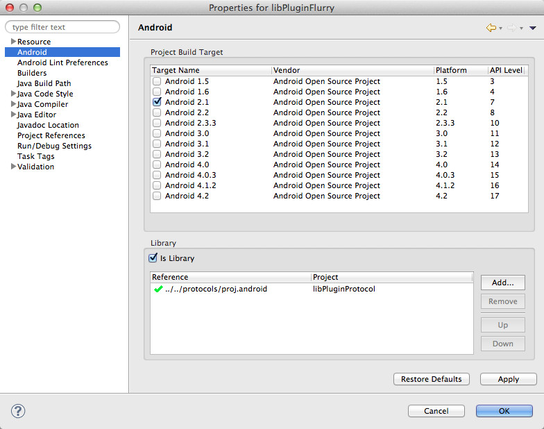

#How to write your own plugin for android

Now we have four protocals in plugin-x: ProtocolAds, ProtocolAnalytics, ProtocolIAP, ProtocolSocial. You don't write any c++/jni code or javascript binding code. We have done it for you in the core code. What you need to do is:

- New a android project.
- Write Java to implement the interface/protocol we defined.

##Introduction to Plugin Directory
Please keep the directory structure of your plugin looks like this:


- proj.android : The android project directory of the plugin.
- proj.ios : The iOS project directory of the plugin.

Attention : The implementation of publish tools depends on the directory structure.

##Implementation of the Plugin

###Import the android project of plugin protocols to Eclipse.


###New a android library project.
Make it depends on project libPluginProtocol.



The project directory looks like this :


1. build.xml : Used by publish tools. You can copy it from other plugins, and modify the project name.
2. ForManifest.xml : Used by tools/gameDevGuide.sh. If your plugin need activity declaration or user permission in AndroidManifest.xml， add them to this file.
3. sdk : Place .jar files of the third party SDK here.
4. src : Place the java code here. You must write a class which implements the relevant interface. It must be in package org.cocos2dx.plugin. 
 
###Write a class implement at least a interface

The class need a constructor with Context parameter. For example:

```
package org.cocos2dx.plugin;
public class AnalyticsFlurry implements InterfaceAnalytics {
        ...
        public AnalyticsFlurry(Context context) {
        mContext = context;
    }
}
```

You can override the methods defined in interface or add your custom methods, such as:

```
@Override
public String getSDKVersion() {
    return "3.2.1";
}

protected void setUserId(String userId) {
    LogD("setUserId invoked!");
    final String curUser = userId;
    PluginWrapper.runOnMainThread(new Runnable() {
        @Override
        public void run() {
            try {
                FlurryAgent.setUserId(curUser);
            } catch(Exception e){
                LogE("Exception in setUserId", e);
            }
        }
    });
}
```

Now plugin-x only support parameter with type int, float, boolean, String, JSONObject , and the return value with type int, float, boolean, String.