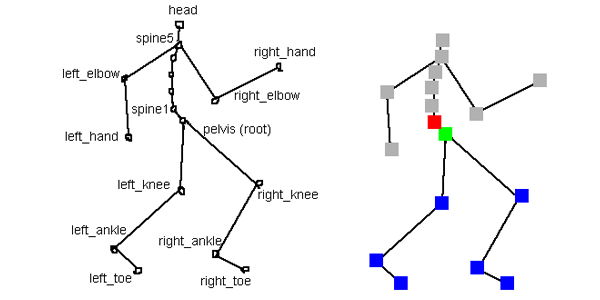
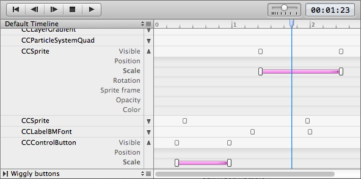
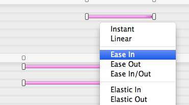
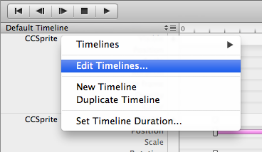
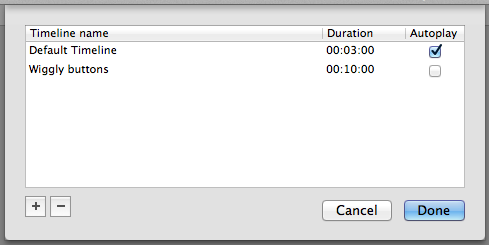
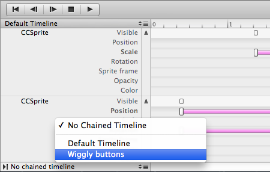

# Skeletal animation 骨骼动画 

## 骨骼动画和精灵表

你可以使用“精灵表”快速简易地创建动画。但当你意识到游戏需要很多动画时，你会发现内存消耗不断上升，加上载入所有数据的时间也不断拉长。此外为了限制大小，你需要为动画保持较低的帧率（FPS），这又意味着动画看起来不会那么流畅。这时，骨骼动画应运而生了。

## 骨骼动画简介

骨骼动画是一种cocos2d-x动画技术。通过这种技术，一个角色由两部分代表：一部分是用于绘制角色的表面表征（叫做皮肤或网状物），另一部分是由互相连接的骨头组成的分级集合（称为骨骼或支架），这部分用于为网状物提供支撑（姿势或关键帧）。

Cocos2d-x支持用户在应用中使用2D骨骼动画。骨骼动画的过程搭建起来有些复杂，但之后使用会非常简单，这里介绍一些简化过程的工具。

使用骨骼动画时，动画是由几根互相连接的骨头组成。影响到一根骨骼即会影响其他的子骨头。通过组合不同骨头的形态，你就会获得不同姿势的骨架。

如果你用某个时间点的特定形态来为骨架中的每一根骨头定义关键帧（keyframe），你可以在关键帧中插值（interpolate）来获取一个流畅的过渡效果从而让骨骼活动起来。

在附件代码中，本人使用的名为“Transformation”的类，该类包含各种2D形态数据如移动、旋转或大小变化等。然后再通过帧号码或像“Transformation”这样的类定义关键帧。关键帧集合即会定义一个关键帧动画（KeyframeAnimation）。最终由很多关键帧动画组成骨骼动画（SkeletonAnimation），骨骼中的每根骨头都会有一个骨骼动画。。

另外骨骼（Skeleton）保留着一系列骨头的节点（Joint），这些节点定义了骨骼中的骨头等级。与“精灵表”不一样的是，每一根骨头都会被分配一个特定的纹理，如下所示。

## 骨骼动画工具

目前CocosBuilder工具很好用，是创建骨骼动画的免费（MIT许可证下）工具。
CocosBuilder是为Cocos2dxs Javascript绑定而制作，也就是说你的代码、动画和界面无需修改即可在Cocos2d-x中运行。
Cocos2d-iphone指南可参考Zynga工程博客。

## CocosBuilder动画介绍

你可以用CocosBuilder来创建角色动画、动画完成场景或其他任何你能想象到的动画。该工具的动画编辑器完全支持多分辨率，支持关键帧缓冲、骨骼动画及多条时间线设计简单等。

### 基本信息

在主界面底部你可以看到时间线（timeline）。使用时间线来创建动画。

默认情况下，“ccb-file”文件只有一条10秒长的时间线。CocosBuilder编辑动画的帧率为每秒30帧，但是当你在应用中回放动画时，动画会按照你在cocos2d上的设置进行播放（默认cocos2d设置为60FPS）。目前的时间进度显示在右上角，采用“分：秒：帧”格式。蓝色垂直线显示的也是当前播放时间。点击时间显示屏可改变当前时间线的时间长度。
### 增加关键帧

CocosBuilder中的动画均基于关键帧。你可以向一个节点的不同属性添加关键帧，CocosBuilder会自动插排关键帧，有选择性地采用不同类型的缓冲。

增加关键帧时，首先点击节点名字右边的三角区域扩大节点视图。这会让你看到节点的所有动画属性。能够活动的属性依照你所选择的节点类型而不同。一旦属性可见，你便能在时间线上点击属性，选择可选项目。这时会在点击的时间上创建一个新关键帧。或者你可以通过选择一个节点然后再在“Animation”菜单中选择“Insert Keyframe”（插入关键帧）在时间标记时刻创建新关键帧。

如果你在区域内改变了节点，关键帧会自动添加到当前时间，因为改变的属性已经在时间线中有一个或多个关键帧。
### 编辑关键帧

通过移动计时器（time marker）到关键帧时刻并选择节点便可编辑特定的一个关键帧。你可以双击这个关键帧（选择节点然后移动计时器）集中编辑该关键帧。

你可以选择关键帧，然后通过拖拽选择框来一起移动这些关键帧。你也可以复制及粘贴节点之间的关键帧。在粘贴关键帧时要确保只选择了一个节点。在计时器到时时便会开始粘贴关键帧。

如果选择了一组关键帧，通过在“Animation Menu”菜单中选择“Reverse Selected Keyframes”可以颠倒关键帧顺序。使用“Stretch Selected Keyframes”选项可以根据度量因子加速或放缓动画。

### 导入一连串图像

如果你的动画是由精灵帧组成，要往时间线里移动每一个精灵帧会非常枯燥。CocosBuilder简化了这个过程，该工具可以自动导入一连串图像。在项目试图的左侧选择想要导入的帧，然后在时间线中选择一个“CCSprite”精灵。从“Animation menu”菜单中的“Selected Resources”选择“Create Frames”。这时精灵帧便会自动在计时器起始创建。如果你想放缓动画速度，选择新建的关键帧，然后使用“Stretch Selected Keyframes…”命令。

### 缓冲应用

CocosBuilder提供了一套精心挑选的缓冲子集。实现缓冲时，右键单击两帧之间，然后选择想要应用的缓冲类型。

部分缓冲选项有其它选项，在设置缓冲类型之后，再次右键单击，从菜单中选择“Easing Setting”（缓冲设置）。

### 使用多条时间线

CocosBuilder动画编辑器非常强大的功能之一便是可以在一个文件中有多条时间线。你可以指定不同的顺序，然后通过指定名称在代码中回放动画。甚至还可能在不同的时间线之间流畅切换。
选择、增加或编辑时间线，打开时间线菜单即可如下所示：

在编辑时间线对话框中，你可以大概了解各时间线、重新命名、增加新时间线以及（可选）设置其中一条时间线为“ccbi-file”文件载入应用后直接自动开始回放的时间线。

时间线中没有关键帧集合的属性值共享于其他时间线。例如，如果你在一条时间线上移动了一个节点，这个节点也会在其他时间线上移动，只要这些时间线的位置属性中没有关键帧集合。有时这点很有帮助，可以增加在一个属性中增加一个单一的关键帧以覆盖某一特定时间线的共享值。

### 连锁时间线

你可以通过连锁（chaining）时间线自动回放一系列时间线。你也可以使用这个功能来自动循环一个时间线。

若要让时间线按序播放，点击“No chained timeline”（不连锁时间线）选择，然后选择在当前时间线后你想要播放的时间线。

### 在代码中回放动画

要从程序上控制你用CocosBuilder创建的动画，需要检索“theCCBAnimationManager”。当“ccbi-file”文件载入时动画管理员会被分配到“userObject”节点

	CCNode *myNodeGraph = ccbReader->readNodeGraphFromFile("myFile.ccbi", this);

动作管理员将会以“autoreleased object”（自动释放对象）的身份返回。要回放特定时间线的动画，请调用“therunAnimationsForSequenceNamed:”方法。如果有时间线正在播放，调用该方法时该时间线会立即停止。

	animationManager->runAnimationsForSequenceNamed("My Timeline");

或者（可选），你可以使用缓冲类TweenDuration来顺利地过渡至新时间线。可能的话也可以使用直线插排（linear interpolation）来进行过渡。

	animationManager->runAnimationsForSequenceNamedTweenDuration("My Timeline",0.5f);

不管时间线已经结束还是正在播放，接受回调函数也是有可能的。即便另外一条时间线已经被顺序连锁了，你也可能会收到这些回调函数。使用“CCBAnimationManagerDelegate”来接受回调函数。

## 参考

[用CocosBuilder创建游戏](http://code.zynga.com/2012/10/creating-a-game-with-cocosbuilder/)

[CocosBuilder文档](http://cocosbuilder.com/)