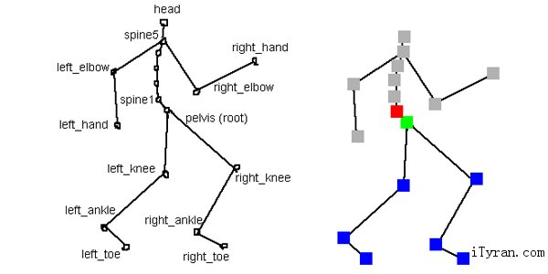
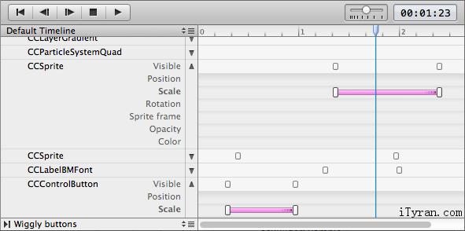
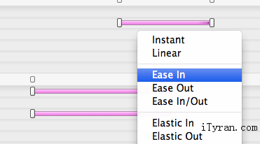
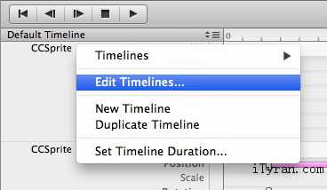
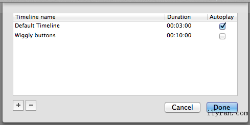
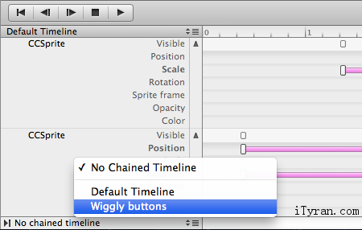

# 骨骼动画 vs. 精灵表（sprite sheets） #

创建动画又快又简单的方法是使用“精灵表”（sprite sheets）.当你意识到游戏需要大量动画,内存消耗会涨上来,而且需要耗时去加载所有数据.此外,限于大小,你需要为了动画限制自己使用低FPS,这意味着动画不是你想要的那么平滑.这就是骨骼动画的由来.

 

## 骨骼动画简述 ##

骨骼动画是cocos2d-x动画在人物渲染方面的技术,分二个部分:用于绘制人物的外观呈现（被称为蒙皮或者mesh）和用于mesh进行动画(造型和关键帧) 的一组分层的相互连接的骨骼.

在你的应用中,Cocos2d-x提供了拥有2d骨骼动画的方式.构建骨骼动画过程开始可能有点复杂,但随后用起来却非常简单,而且有一些工具可以简化此过程.

当使用骨骼动画时，动画由一些相互连接的骨骼组成。影响一个骨骼将会影响其所有的子对象。通过每根骨头上不同的变换组合，你会得到骨骼的各种造型。

现在，如果你定义了关键帧，即某个时间点骨骼中每根骨头特定的变换，你就能在关键帧之间插入平滑的过渡，从而使骨骼运动。

在附加的代码中，我使用一个名叫Transformation的类，它含有2D变换的数据，如translation（平移）、rotation（旋转）和scale（缩放）。通过帧的编号和一个Transformation能定义一个关键帧。关键帧的集合定义了一个KeyFrameAnimation.最后，骨骼动画就是一个KeyFrameAnimation的集合，每个KeyFrameAnimation应用于骨骼中的每根骨头。

另外，你使用骨骼，它保存了关节列表，关节定义了骨骼中骨头的层级。不同于“精灵表”，每根骨头指定了特定的texture，如下所示：

 

## 骨骼动画工具 ##

据我们所知，在创建骨骼动画方面[CocosBuilder](http://cocosbuilder.com/)是一个不错的、免费（MIT协议）的工具。

CocosBuilder为Cocos2d的Javascript绑定而创建的。这意味着你的代码、动画和接口会无修改地在Cocos2d-x中运行。

cocos2d-iphone的教程可以在[Zynga Engineering blog](http://code.zynga.com/2012/10/creating-a-game-with-cocosbuilder/)找到。

 

## 与cocosbuilder动画协作 ##

你可以使用CocosBuilder创建人物动画，全场景动画或者你所想的任何动画。该动画编辑器已完全支持多分辨率、关键帧间的缓冲动画、骨骼动画和多时间轴等特性。

基础

在主窗口的下部，你可以找到时间轴。你可以使用时间轴来创建你的动画。

默认情况下你的ccb-file只有一条时长10秒的时间轴。CocosBuilder编辑动画的帧率是每秒30帧，但是当你在应用程序中回放动画时，会使用你给cocos2d设置的帧率（cocos2d中默认是60fps）。当前时间会在右上角显示，格式是分：秒：帧。蓝色垂直线也显示了当前时间。单击显示时间以更改当前时间线的时间间隔。

增加 Keyframes

CocosBuilder中的动画是基于关键帧的。你可以添加关键帧以设置node的不同属性并且CocosBuilder会自动在关键帧间插入不同类型的可选（ease）缓冲动作。

为了添加关键帧，首先通过点击node名字右边的三角形展开node的视图。上面会展现该node所有可动画的属性。基于你选择的node类型，可以动画的属性会稍微有点不一样。凡是可见的属性，你可以在时间轴中按住option键并点击该属性。在点击的那个时间点就会创建新的关键帧。或者，你可以通过选择一个node再在Animation菜单中选Insert Keyframe从而在时间标志器的那个时间点生成一个新的关键帧。

如果你在画布区域变换一个node,并且该node所变换的属性在时间轴上已经有一个或多个关键帧，那么CocosBuilder会自动在当前时间点添加关键帧。

 

编辑 Keyframes

移动时间标志器至特定关键帧的时间点并选择该node，编辑该关键帧。你可以通过双击关键帧聚焦于该帧（聚焦即选择该node并移动时间标志器）。

你可以选择关键帧并通过拖拉它们周围的选择框来移动它们。你也可以在node间复制、黏贴关键帧。当黏贴关键帧时，确保你只选择了一个node。关键帧会黏贴在时间标志线标志的时间。

如果你已经选择了一系列关键帧，可以通过选择Animation菜单中的Reverse Selected Keyframes来反向关键帧的次序。使用Stretch Selected Keyframes选项可以通过一个缩放因子来加速或者减速动画。

导入多张连续图片

如果你通过sprite frame帧组创建动画，需要冗长的时间来将每个独立的帧移至时间轴上。CocosBuilder通过自动导入图像序列简化了这一过程。选择你想要导入到左边项目视图的帧，然后选择时间轴上的一个CCSprite。现在选择Animation菜单中的Create Frames from Selected Resources.这些帧会在时间标志线开始的地方添加。如果你需要放慢动画，选择新创建的关键帧组，并使用Stretch Selected Keyframes…命令。

 

应用渐变

CocosBuilder提供了cocos2d给予的一些精心挑选的缓冲动作（easing）子集。应用一个缓冲动作只需在两个关键帧之间右键点击并选择你想应用的缓冲动作的类型即可。

一些缓冲动作有额外的选项，在应用缓冲动作之后，你可以再次右击并从弹出菜单中选择Easing Setting…。

使用多个时间轴

CocosBuilder的动画编辑器有一个非常强大的特性就是在单个文件中可以含有多个时间轴。你可以命名不同的序列并通过它们的名字从代码中播放它们。在不同的时间轴之间会有平滑的过渡。

在选择之前，使用时间轴弹出菜单添加并编辑你的时间轴：

在编辑时间轴的对话框中，你可以获得时间轴的大致信息、重命名它们、添加新的时间轴以及（可选）设置时间轴中的一条在ccbi文件从你的应用程序加载后立即自动开始播放。

没有设置关键帧的时间轴中的属性会在时间轴时间共享它们的值。例如，如果你移动某条的一个node，只要它没有为位置属性设置关键帧，它就会在所有的时间轴中被移动。有时，我觉得为一个特定的时间轴添加单个关键帧来覆盖共享值是挺有用的。

锁定时间轴

你可以通过锁定时间轴来自动回放时间轴序列。你也可以使用这个特性来自动重播一个时间轴。

为了播放时间轴序列中的一个时间轴，点击No chained timeline文本并选择当前时间轴后你想播放的那个。

通过代码播放动画

想要通过代码控制你用CocosBuilder创建的动画，你需要检索CCBAnimationManager。当ccbi文件加载时，该动画管理器将分配node userObject。

	CCNode *myNodeGraph = ccbReader->readNodeGraphFromFile("myFile.ccbi", this); 

动作管理器会作为一个自动释放对象返回。回放特定的时间轴需调用runAnimationsForSequenceNamed: 方法。如果时间轴当前正在播放，当调用此方法时它会立刻停止。

	animationManager->runAnimationsForSequenceNamed("My Timeline"); 

或者，你可以使用时间轴之间的时间间隔来平滑过渡到新的时间轴。一般情况下线性插入会应用于此过渡。

	animationManager->runAnimationsForSequenceNamedTweenDuration("My Timeline",0.5f); 

也可以在时间轴播放完毕后接收一个回调。即使另外的时间轴锁在序列中，你也能接收到这些回调。你可以用CCBAnimationManagerDelegate来接收回调。

## 总结 ##

谢谢你们花时间来阅读本教程，祝编程愉快！如果你有其他骨骼动画的动作，请通知我们或者发邮件到此wiki。

## 参考 ##

[Creating a game with cocosbuilder](http://code.zynga.com/2012/10/creating-a-game-with-cocosbuilder/)

[CocosBuilder Documentation](http://cocosbuilder.com/)
  

标签：`cocos2d-x官方文档` `骨骼动画详解`