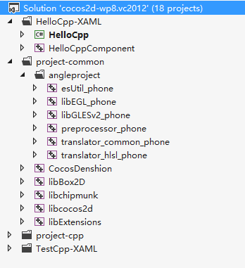

# use webbroswer to integrate Alipay on Windows Phone 8

## Brief

Since there is not apipay SDK on wp8, we can use WAP and Server to pay. In this situlation, we just need to add Windows Phone Page that contains WebBrowser control, you have to implement the Server that response to the web.
I will show you a example of how to respond CCMenuItem click event to add a C# class, that is a way of using WinRT component to invoke C# library. The example code all in the github branch: [https://github.com/koowolf/cocos2d-x/tree/webbroswer](https://github.com/koowolf/cocos2d-x "koowolf/cocos2d-x")。

## create Windows Phone XAML and Direct3D App project

 the cocos2d-x contains XAML project in the Github now, [https://github.com/cocos2d/cocos2d-x/tree/master/cocos2dx/platform/wp8-xaml](https://github.com/cocos2d/cocos2d-x/tree/master/cocos2dx/platform/wp8-xaml), pull the codes and open cocos2d-wp8.vc2012.sln, you will see the structure as following：



I will add example in this project.

## add a CCMenuItemFont in HelloWorld project ##

add CCMenuItemFont in the HelloWorld::init() function，and add a response function HelloWorld::menuCallPageTest()，it will call HelloWorld::menuCallPageTest() while you click the menu.

``` c++
#if (CC_TARGET_PLATFORM == CC_PLATFORM_WP8)
	// add a menu item to add a xaml page
	CCMenuItemFont::setFontName("Marker Felt");
	CCMenuItemFont *pNextItem = CCMenuItemFont::create("Add Xaml Page", this, menu_selector(HelloWorld::menuCallPageTest));
	pNextItem->setPosition(ccp(origin.x + visibleSize.width - pNextItem->getContentSize().width / 2, 
		origin.y + pCloseItem->getContentSize().height/2 + pNextItem->getContentSize().height + 10));

	// create menu, it's an autorelease object
	CCMenu* pPageMenu = CCMenu::create(pNextItem, NULL);
	pPageMenu->setPosition(CCPointZero);
	this->addChild(pPageMenu, 1);
#endif

```

``` c++
void HelloWorld::menuCallPageTest( CCObject* sender )
{
#if (CC_TARGET_PLATFORM == CC_PLATFORM_WP8)
	BroswerEventHelper^ helper = ref new BroswerEventHelper(); 
	helper->ShowWebBroswer();
#endif
}

```

it will call ShowWebBroswer() in menuCallPageTest( CCObject* sender )， it invoke a response function as following

## defind a C++ managed class BroswerEventHelper ##

we can add a BroswerEventHelper in the Runtime Component project, we declare a function in HelloWorldScene.h, and implement its class memeber function in HelloWorldScene.cpp

``` c++
#if (CC_TARGET_PLATFORM == CC_PLATFORM_WP8)
namespace PhoneDirect3DXamlAppComponent
{
	public delegate void ShowWebBroswerDelegate();
	public ref class BroswerEventHelper sealed
	{
	public:
		BroswerEventHelper(void);
		void SetShowWebBroswerDelegate(ShowWebBroswerDelegate^ delegate);
		bool ShowWebBroswer();
	private:
		property static ShowWebBroswerDelegate^ m_broswerDelegate;
	};

}
#endif

```

it call SetShowWebBroswerDelegate method in C# code, set a delegate class, and make it as static class, so we can use the static instance variable either in C++ code or in C# code, to invoke any function. The ShowWebBroswer() function call the m_broswerDelegate delegate in C++ code, that is call back function.
We implement the delegate function in the C# code the next step.

``` c++
#if (CC_TARGET_PLATFORM == CC_PLATFORM_WP8)
namespace PhoneDirect3DXamlAppComponent
{

	BroswerEventHelper::BroswerEventHelper(void)
	{
	}

	void BroswerEventHelper::SetShowWebBroswerDelegate(ShowWebBroswerDelegate^ delegate)
	{
		m_broswerDelegate = delegate;
	}

	bool BroswerEventHelper::ShowWebBroswer()
	{
		if (m_broswerDelegate)
		{
			m_broswerDelegate->Invoke();
			return true;
		}
		return false;
	}
}

using namespace PhoneDirect3DXamlAppComponent;
#endif

```

## implement delegate function in C# code ##

set delegate in DrawingSurface_Loaded() in MainPage.xaml.cs. add codes as following：

``` c++
BroswerEventHelper helper = new BroswerEventHelper();
helper.SetShowWebBroswerDelegate(ShowWebBroswer);

```

ShowWebBroswer is a delegate function， implement in MainPage class as following：

``` c++
        public void ShowWebBroswer()
        {
            Dispatcher.BeginInvoke(() =>
            {
                this.NavigationService.Navigate(new Uri("/WebBroswerPage.xaml", UriKind.Relative));
            });
            return;
        }

```

we use this.NavigationService.Navigate to jump to next page， we add a windows phone page next step。

## add WebBroswerPage.xaml page ##

right click the project, select "Windows Phone Portrait Page" under Visual C#, renamed it as WebBroswerPage.xaml, and add as following:


we finish add the page in the project, and design other function in page by yourself, like as jump to  page of WebBroswerPage.xaml, we can add a Back button response function(double click the button to add response function), and jump to the last page while click, as following:


``` c++
        private void Button_Click(object sender, RoutedEventArgs e)
        {
            this.NavigationService.GoBack();
        }

```


