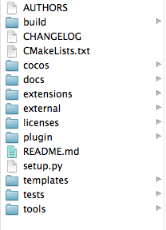
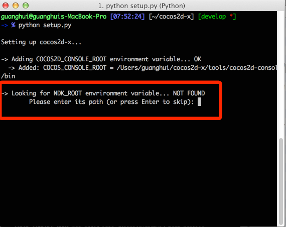
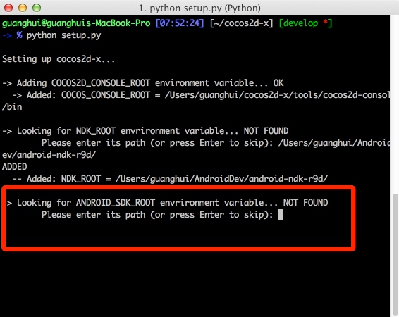
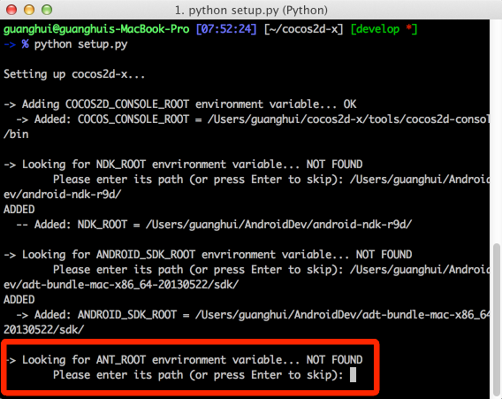
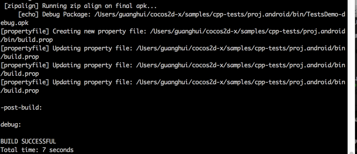

## How to Run Cocos2D-X Samples on Android

Let's take MacOS as an example, the processes on win32 and linux are more or less the same.

### Prerequisite

#### Download Cocos2D-X
At first, you should download [Cocos2d-x](http://cocos2d-x.org/download) and unzip it. We could simply unzip it on the root directory of your home folder.

Double click the folder *cocos2d-x* and you will find a lot of files and folders. Here is the screenshot:



Before configuring the development environment, let's download some dependency softwares at first.

#### Download JDK, SDK and NDK
Since we are trying to develop Android games, so Java is a necessary toolkit.

- Open Your Terminal(You can hit Control-Space to open Spotlight and enter "Terminal" and hit "Enter" key), input the following commands to verify whether your machine supports java or not.

```
java -version
```
If the following lines shown on your Terminal then you may have get [JDK](http://www.oracle.com/technetwork/java/javase/downloads/index.html) properly installed.

(Note, the java version number may be different, but it's doesn't matter. As to Cocos2d-x, you could upgrade the JDK and we recommend you to install JDK 1.6 or 1.7)

```
java version "1.7.0_51"
Java(TM) SE Runtime Environment (build 1.7.0_51-b13)
Java HotSpot(TM) 64-Bit Server VM (build 24.51-b03, mixed mode)
```
- Download the Android SDK. If you are using Mac, click [this link](https://developer.android.com/sdk/index.html?hl=sk) to download *ADT Bundle for Mac*.

The bundle includes the newest Android SDK version plus an Eclipse version with Android Development Tool installed. So we don't need to download an extra Eclipse and install it
the ADK manually any more.

After downloaded it, unzip the package into ~/AndroidDev directory. The folder contains two folders: *sdk* and *eclipse*. 
You could launch the Eclipse and install other SDK versions. Here is an example:


- Download NDK. Here is the [download link](https://developer.android.com/tools/sdk/ndk/index.html). You could always prefer the latest version. When we are writing this article, the latest version of NDK is *r9d*. 

After downloading it, unzip the package at the same location of the Android SDK. In our case, it is under the *~/AndroidDev* directory.


#### Verify Your Environment
Aha, we have installed all the required softwares. Let's do the final verification.

At first, we should verify that *python 2.7* is installed and it is accessible under the current user's environment which means you could type `python --version` in your Terminal(or Command Line on win32) and it will give you the following result:

```
-> % python --version
Python 2.7.5
```

If there is a prompt like "command not found: python" which means your python environment is not correct, you should install it. We recommend you install python with homebrew.

```
brew install python
```
If the homebrew isn't  installed on your system, please refer to [this link](http://brew.sh/) for more information.

At last, let's install *ant* tools. If you are a homebrew user, you could simply type the following command in your terminal to install ant:

```
brew install ant
```


### Time in Action - Step By Step Guides
Configure Andriod development environment is really tough but worth it, isn't it? 

Without any further ado, let's rock!
#### Use setup.py to configure your android development environment
At first, open your Termial and cd to *~/cocos2d-x*.

If you type *ls* command, it will show you all the files. 

Now, type ` python setup.py` and you will get the following results:



It added the *COCOS2D_CONSOLE_ROOT* environment variable to point to the *bin* directory under *~/cocos2d-x/tools/cocos2d-console* directory.


And then it looked for an *NDK_ROOT* environment variable. If you haven't configured this environment before, it will prompts you the environment variable is not found and you should enter the path of your NDK.

In our case, we could input `/Users/guanghui/AndroidDev/android-ndk-r9d/`. 

*Caution: You must expand the ~ sign to your own user directory path. Otherwise, the scripts will fail due to error path value.*

Here is the screenshot:



Now it's time to repeat the last process to configure the *ANDROID_SDK_ROOT*. You can simply input `/Users/guanghui/AndroidDev/adt-bundle-mac-x86_64-20130522/sdk/`. The adt-bundle-mac-x86_64-xxxx, the xxxx number maybe different. So please note this non-trival difference.

If you don't install *ant* program, you should install *ant* first.

After you have installed *ant*, when the scripts ask you to config the *ANT_ROOT*, you can simply hit *Enter* key and let the scripts do the remaining jobs for you.



If all the environment variables are correctly configured, you should let them take effect.

On *nix systems, you could issue the following commands:

```
source ~/.bash_profile
```

on win32 system, you can just close the command line windows and restart it.


#### Use android-build.py to build Cocos2d-x samples

Now it's time to compile the built-in samples of Cocos2d-x.

At first, you should change your directory to the android-build.py scripts lays.

```
cd build
```

and then 

```
python android-build.py -p 10 cpp-tests
```
Bang! Hit enter and the scripts will handle all the remaining things for you.

Let's over all the parameters to android-build.py. 

If you only type `python android-build.py` in the Terminal, it will give you the following results:


Please read the help information carefully when this is your first time trying to build Cocos2d-x.

If all things are going well, you will get the following meesages:




#### How to deploy it on your Android phone via command line
Now it's time to test on your Android device.

At first, you should enable *[USB Debugging](http://stackoverflow.com/questions/16707137/how-to-find-and-turn-on-usb-debugging-mode-on-nexus-4)* on your phone and then connect your device via an USB line.

At first, change your directory to the the *bin* directory of *testcpp* android project:

```
cd ~/cocos2d-x/tests/cpp-tests/proj.android/bin
```

(Note:If your current directory is *build*, you could use some relative path like this`cd ../tests/cpp-tests/proj.android/bin`)

Then you could use adb to install the apk to your android phone:

```
adb install CppTests-debug.apk
```

If it prompts you the adb is not a command, then you could run the following commands in your Terminal or add this code line into your ~/.bashrc file.

```
 export PATH=$PATH:$ANDROID_SDK_ROOT/tools:$ANDROID_SDK_ROOT/platform-tools
```

If it gives you the following screenshot, congratulations, it's done!


#### Troubleshootings
- After configuring the setup.py file, you still suffer NDK_ROOT not found issue, you maybe miss sourcing the ~/.bash_profile file.

- If you are on Windows pc, you should be careful about the difference of the filesystem conventions.


### In Summary
In this article, we use the MacOS system as our development environment. But it should work well on other platform. 

If you are creating a new project with cocos2d-console, you should try [this documentation]() for more help to get it run on your Android phone.

If you have any problems, please post it on the [forum](http://cocos2d-x.org/forums/6).
