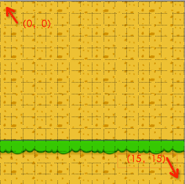

#瓦片地图

在游戏开发过程中，我们会遇到超过屏幕大小的地图，例如即时战略游戏，使得玩家可以在地图中滚动游戏画面。这类游戏通常会有丰富的背景元素，如果直接使用背景图切换的方式，需要为每个不同的场景准备一张背景图，而且每个背景图都不小，这样会造成资源浪费。

瓦片地图就是为了解决这问题而产生的。一张大的世界地图或者背景图可以由几种地形来表示，每种地形对应一张小的的图片，我们称这些小的地形图片为瓦片。把这些瓦片拼接在一起，一个完整的地图就组合出来了，这就是瓦片地图的原理。

##TileMap方案

在Cocos2d-x中，瓦片地图实现的是TileMap方案，TileMap要求每个瓦片占据地图上一个四边形或六边形的区域。把不同的瓦片拼接在一起，就可以组成完整的地图了。我们需要很多较小的纹理来创建瓦片。通常我们会将这些较小的纹理放图一张图片中，这样做会提高绘图性能。

##瓦片地图编辑器

Cocos2d-x支持由瓦片地图编辑器Tiled Map Editor制作并保存为TMX格式的地图。Tiled Map Editor是一个开源项目，支持Windows、Linux及Mac OS X多个操作系统，我们可以从[官网下载](http://www.mapeditor.org/)到编辑器的Java和QT版本。

如何使用Tiled工具建立地图可以参考以下文章：

[如何使用Cocos2dx3.0制作基于tilemap的游戏](http://cn.cocos2d-x.org/tutorial/show?id=1205)

###地图方向

Tiled地图支持直角鸟瞰地图(90°地图)、等距斜视地图（斜45°地图）和六边形地图，不支持左右或上下边界的六边形地图。

###地图资源

- 建议瓦片地图素材大小为32*32的倍数
- 瓦片素材组与其他图片不能混合使用
- 只有瓦片素材图能被导入TMX文件
- 每个Layer最多支持1套瓦片素材组。

###瓦片层

- TMX文件中瓦片层的数量没有上限
- 每一个瓦片层只能由一种瓦片素材组成
- 每一个瓦片层可以被TMXLayer类表示-为SpriteSheet的子类
- 每一个单一的瓦片被Sprite表示-父节点为TMXLayer

###对象层

- 瓦片地图支持对象组
- 用来添加除背景以外的游戏元素-道具、障碍物等
- 对象组中的对象在TMX文件中以键值对形式存在，因此可以直接在TMX文件中对他进行修改

###瓦片地图坐标系

对于一个16*16的瓦片地图文件的坐标系统为

- (0, 0): 左上角
- (15, 15): 右下角




##在Cocos2d-x中使用TMX

###创建TMX节点

```
	TMXTiledMap *map = TMXTiledMap::create("bg.tmx");
    addChild(map, 0);
```

###遍历子节点
```
    Vector<Node*> pChildrenArray = map->getChildren();
    
    SpriteBatchNode* child = NULL;
    
    Ref* pObject = NULL;
    
    for (Vector<Node*>::iterator it = pChildrenArray.begin(); it != pChildrenArray.end(); it++) {
        pObject = *it;
        child = (SpriteBatchNode*)pObject;
        
    }
```

###获取/删除一个瓦片

```
	TMXLayer* layer = map->getLayer("layer0");
    Sprite* tile0 = layer->getTileAt(Point(1, 15));
    layer->removeTileAt(Point(1, 15));
```

###遍历对象层中对象

```
	TMXObjectGroup* objectGroup = map->getObjectGroup("center");
    ValueVector object = objectGroup->getObjects();
    
    for (ValueVector::iterator it = object.begin(); it != object.end(); it++) {
        Value obj = *it;
        ValueMap map = obj.asValueMap();
        log("x = %d y = %d", map.at("x").asInt(), map.at("y").asInt());
    }
```