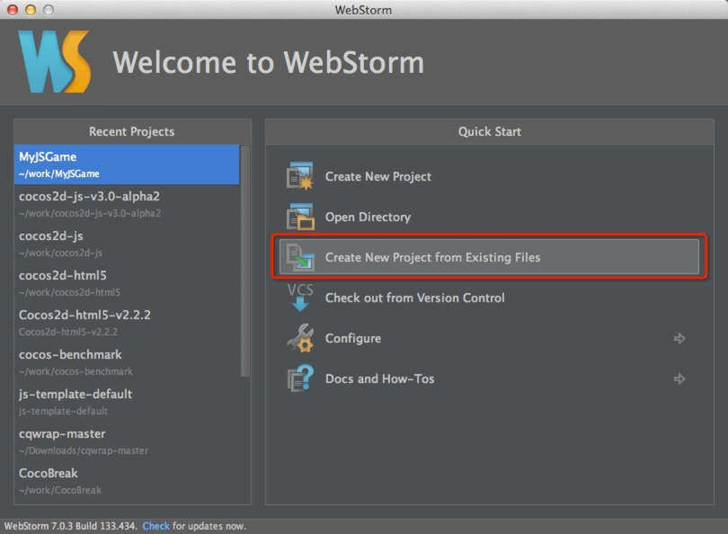
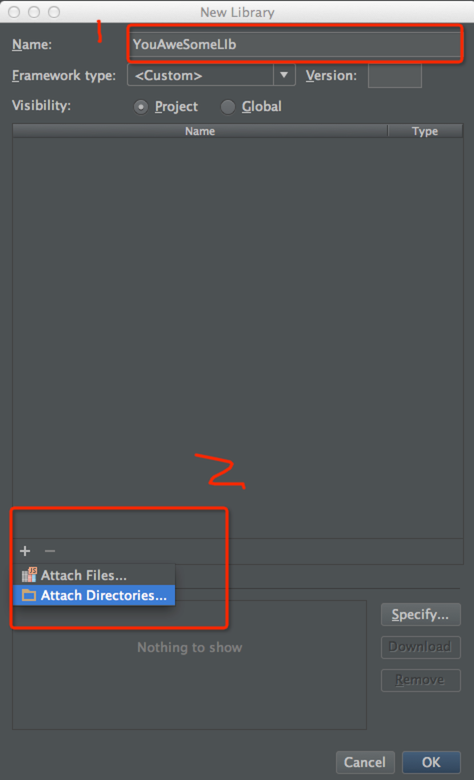
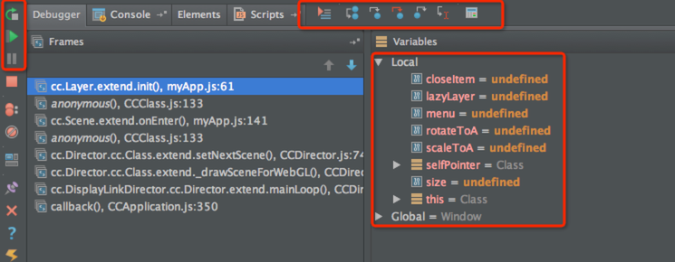

#Setting up Cocos2d-JS Development Environment
In this documentation, I will show you how to setup a Cocos2d-JS development environment on MacOS 10.9 -- Yeah! The Maverics.

##Download the required software packages

1. Download and install WebStorm 7. The current stable release of [WebStorm 7](http://www.jetbrains.com/webstorm/download/index.html) is 7.0.3.  Why do we choose WebStorm? Because it provides many feature like javascript code syntax completion, debugging, syntax highlighting, version system integrated etc. You can go to WebStorm's official website for more information.

2. Download Cocos2d-JS v3.0 alpha from the offical website of Cocos2d-x. Here is the [Link](http://cocos2d-x.org/download ) .After you downloaded the Cocos2d-JS v3.0 alpha. You should unzip it to a proper location. In our case, I unzip it at ~/work/cocos2d-js-v3.0-alpha2.The ~ simbol represents your home directory path, which in our case is /Users/linshun. 

**Note:** 
	
You can also get the cutting edge version of Cocos2d-JS through github. Here is the [Cocos2d-JS github repository](https://github.com/cocos2d/cocos2d-js ) .The active development work are done in **develop** branch.

3.  Download and install Chrome 34 and the [JetBrains-IDE-support ]( https://chrome.google.com/webstore/detail/jetbrains-ide-support/hmhgeddbohgjknpmjagkdomcpobmllji)  extension.
 
All right, let's see how to configure WebStorm 7 to develop and debug our Cocos2d-JS applications.

## How to create an new project
Cocos2d-JS provides a console tool that makes the development of CH5 and JSB application more simpler and much convenient. You can use it to create a new project, publish it to android, iOS, Mac OS or web, and it's very easy to use.

### Console tool setUp
First step, you need to setup before using this tool. Please clone Cocos2d-JS repository and update all submodule. Open console in Cocos2d-JS folder, then just run ./setup.py on console. You may need to provide your NDK, Android SDK and ANT's path during the setup. Note that this tool is developed with python, so you will need python (32bit) 2.7.5 or later installed on your machine (but it doesn't support Python3).
** Note: ** please execute source ~/.bash_profile to make the environment setting take effect immediately.

### Create a new project

```
// Create a project contains Cocos2d-x JSB and Cocos2d-html5:
cocos new -l js

// Create a project contains Cocos2d-html5 only:
cocos new -l js --no-native

// Create a specified name project in a specified directory:
cocos new projectName -l js -d ./Projects
```
In this tutorial, we use cocos new -l js to create a MyJSGame in current workspace.

### Run the project

* Run Cocos2d-JS project with a Websever:

```
cd ~/work/MyJSGame
cocos run -p web
```

* Compile and run project in Cocos2d-x JSB :

```
cd ~/work/MyJSGame
cocos compile -p ios|android|mac
cocos run -p ios|android|mac
```

* Useful options

```
-p platform : The platform can be ios|mac|android|web.
-s source   : Your project directory, if not specified the current directory will be used.
-q          : Quiet mode, remove log messages.
-m mode     : Mode debug or release, debug is default
--source-map: General source-map file. (Web platform only)
```

## Configure WebStorm to work with Cocos2d-JS

At first, you should launch WebStorm 7. If it is your first time to launch WebStorm, it will ask you to choose your personal preference like choosing key mappings. 

Here is my screenshot of launching WebStorm:

   **Figure 1**

  


**Note:** 
   The section Recent Project should be empty if it is your first time to run WebStorm.

Now, Let's try Cocos2d-JS within WebStorm.

1. Open an exsiting project - MyJSGame

	As we can see from the above picture, you should choose **Create New Project from Exisiting Files** 
	
	Then it will prompt you with the following options:
	
	**Figure 2**
	
	

2. Choose **Source files are in a local directory, no Web server is yet configured** and click **Next** to continue.

	**Figure 3**

	

3. At this step, you should expand the directory tree to specify where you put your MyJSGame source code. After you have specified the correct directory, note that the **Finish** button is still gray.

4. Now we should set the directory as **Project Root**. Click the **Project Root** button and the **Finish** button will be activate.

	**Figure 4**

	

5. Congratulations! You have successfully configured the Cocos2d-JS project for WebStorm.

## Play with Cocos2d-JS

Since you have added the entire Cocos2d-JS project directory to WebStorm 7. WebStorm will parse all the Cocos2d-JS source code. If you open **MyJSGame/src/myApp.js**, you can obtain the ability of acurate syntax completion.

**Figure 5**


If you have a third party javascript library in your Cocos2d-JS game apps, you can also add it to the WebStorm library for parsing and enable realtime syntax autocompletion.

Here is the instructions:

### (Optional) Add a third party library for parsing

1. Click **Settings** to launch your project settings dialog:

	**Figure 6**

	

2. After clicking the **Settings** menu, it will popup the followings dialog:
	
	**Figure 7**
	
	

3. Now you should click **Add...** button and it will prompts you to specify the location of your javascript library. 
	
	**Figure 8**
	
	

### Debug Cocos2d-JS javascript code within WebStorm
Now it's time for us to debugging Cocos2d-JS code.

#### Connect WebStorm to Chrome with JB chrome extensions
1. Right click the **index.html** under **~/work/MyJSGame** and choose **Debug 'index.html'**:
	
	**Figure 9**
	
	
2. Now it will open your Chrome automatically. If you put your mouse above the JB plugin,
it will show you that it has been connected with WebStrom 7.0.3:

	**Figure 10**
	
	

**Note:** This is step is very straightforward, once you have installed the plugin--"JetBrains IDE support". When you click the debug menu in WebStorm, it will connect to chrome automatically. How convenience it is! You can also click the **JB** icon in the right side of Chrome's side bar and it will bring you to the WebStorm IDE immediately.

#### Debug javascript code in WebStorm
Back to WebStorm and double click **MyJSGame/src/myApp.js** to view the source code.

1. Set the break point. Right click the left sidebar of myApp.js source code viewport.

	**Figure 11**
	
	

2. Start debugging. WebStorm will launche your chrome browser automatically, and run the sample project. Then back to your WebStorm by clicking JB icon. And the program will stop at the break point we have just set. And the editor will switch to Debug View:

	**Figure 12**
	
	

3. Now you can do debugging things like step out, step into, step over, continue executing etc. 

## Summary
In this tutorial, I have shown you the basic steps to configure cocos2d-html5 to work with WebStorm 7, including configuring syntax aware auto complete and debugging. The process is quite simple and straightforward. If you have any questions or suggestion of this tutorials, please let us know. we will appreciate your contribution.

## Where to go from here
In the next tutorial, I will show you how to setup an new Cocos2d-JS project. And we will walk through the built-in tests and sample games of Cocos2d-JS.
