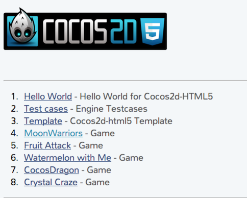
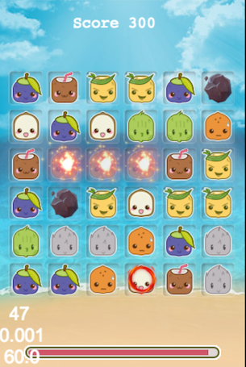
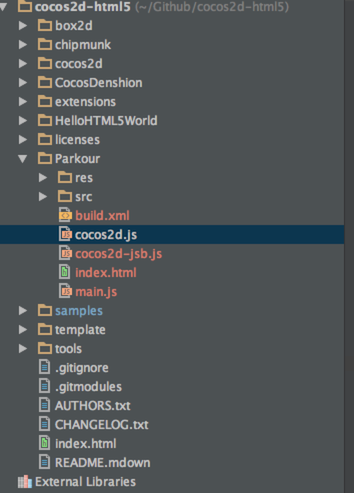
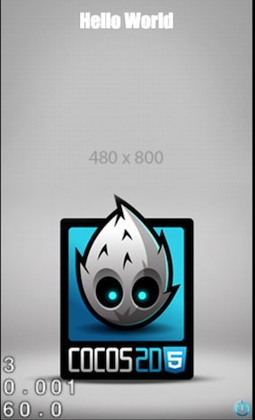
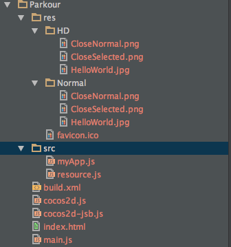
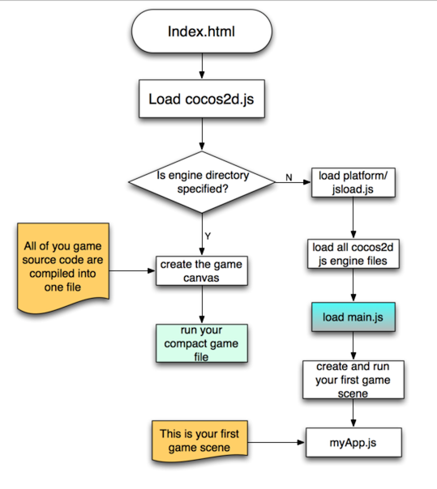

#Hello World Cocos2d-HTML5
In the tutorial, I will show you how to setup a new cocos2d-html5 project from scratch. Before that, I want to
give you a brief description of cocos2d-html5's directory structures.

## Overview of cocos2d-html5 directory structures
Here is the cocos2d-html5 directory structure:

**Figure1**


###Understanding the directory structures

The directory structures can be separated into four parts:

#### Part1: engine related folders

- The **cocos2d** directory holds all the core engine files. The main components of cocos2d-html5 are implemented in these js files.

- The **CocosDenshion** directory holds all the audio engine related files.

- The **extension** directory holds some useful extension modules, such as EditBox, CocosBuilder Reader and CocoStudio Reader, etc. 

- The folder **box2d** and **chipmunk** are third party physics engine.

#### Part2: tests,sample games and template

- The folder **HelloHTML5World** contains a simple **Hello World** sample. When you are new to cocos2d-htlm5, you may want to give it a try. It is the minimax skeleton of a full cocos2d-html5 app.

- The **template** is more or less the same as **HelloHTML5World** except for that **template** is more clean. **Template**  folder is where you should start from. At the end of part of this tutorial, we will create a new project based on this folder.

- The **samples** directory, it contains all the **tests** of cocos2d-html5. It also includes some playable sample games. All the tests and games can be run in iOS and android with javascript binding. 

#### Part3: miscellaneous

- The **license** directory includes all the license files in this project, as we mentioned before, the license of Cocos2d-html5 is MIT,you can refer to the folder to get more details about the licenses of cocos2d-html5.

- The **tools** directory includes JS Doc tool and closure compiler. The **template** folder contains a build.xml which is a config file for closure compiler, you can package your game into one single file via Ant. 


## Taking a look at the built-in examples

When you have downloaded and configured your Cocos2d-html5 development environment successfully. It is highly recommended  to take a look at the built-in examples. It covers over 90% features of Cocos2d-html5. And it is also the most valuable learning resource that you can get currently. 

When you debug the index.html file within WebStorm, it will open the index.html file in Chrome and you will get the following result:

**Figure 2**



As we can see, there are many demos and sample games. If you are curious about what Cocos2d-html5 can do , prepare a coffee, sit down and take a look at the built-in sample games. 

### Taking a Look at the Tests
In Figure 2, when you open the link named “Test cases”. It will show you the entire tests built-in with Cocos2d-html5. Here is the screenshot:

**Figure 3**


The tests are the best learning resources for you. The tests show nearly every features of Cocos2d-html5. You can tweak these tests files and you will get feedback immediately after refresh browser. It is better to have a taste of Cocos2d-html5 this way than reading a huge documentation at the very beginning.


### Taking a Look at the Sample Games

There are 2 types of full game samples built-in with Cocos2d-html5. All of the source code are completely free and open to you. Here is a brief introduction about these sample games

#### MoonWarrior

The first game I would like to show you is MoonWarrior. It is a vertical shooting game. In this game sample, many useful game techniques are applied, including tiled-map, animation, parallax background etc. Here is the screenshot, you can dive into the source code for more information:

**Figure 4**


#### Fruit Attack

This is a matching game. You can swap the position of the nearby fruits, if there are three or more  fruits with same type in vertical direction or horizontal direction. You are getting a match. And the same fruits will be cleared.  Here is the screenshot:

**Figure 5**



There are also other type games, you could try it by yourself.

## Setting up your first "Hello World" Project

Finally, we are reaching the final important part of this tutorial. Here I wil not really create a "Hello World" project. I will take Parkour game as a example. In the future, all of these epic tutorials are about how to make a Parkour game with cocos2d-html5.

Can't help waiting? Let's do it right now!

### Making Parkour project skeleton

As we talked before, there is a **template** folder under cocos2d-html5 root directory. Right click the **template** folder and choose **Duplicate** to create a copy of it. Then modify the **Template Copy** folder to **Parkour**.

Now open your WebStorm and there will be a new directory in the previous Project Root. Now the project navigator looks like this:

**Figure 6**



Right click the **index.html** in WebStorm and choose **Debug 'index.html(1)'**. It will open your Chrome automatically and you have successfully setted up a new project. Cheers! The browser address is 

```
http://localhost:63342/cocos2d-html5/Parkour/index.html.
```

**Note:**

If the "Hello World" png file is not properly displayed in your browser. You can open main.js under Parkour and modify the following code line:

```
   cc.EGLView.getInstance().setDesignResolutionSize(designSize.width, designSize.height, cc.RESOLUTION_POLICY.NO_BORDER);
```

to

```
   cc.EGLView.getInstance().setDesignResolutionSize(designSize.width, designSize.height, cc.RESOLUTION_POLICY.SHOW_ALL);
```

Why should we do this little change? What's the magic? Haha, It is a very long story of cocos2d-x's Multiple Resolution Adaption. If you want to know more about the mechanism of this topic, refer to [this link](http://cocos2d-x.org/wiki/Multi_resolution_support) for more information. We will cover this topic in the future tutorials.

After this modification, save and run, it gives us the classic **Hello World** screenshot:

**Figure 7**




### Sample game template code analysis

Since the **template** brings us so many things, but we even don't know anything about it.

Such as what is the main entry of the template program. How are  these files organized? What does each file do in the sample program? In this section, I will give you some explanation of these questions.

#### Taking a look at all the files of the project

At first, let take a look at all the files and the directory structure:

** Figure 8**



In the Figure 8, we can see that:

- the **res** directory. It contains all the resource filed needed by our project. Now it only contains some sample pictures. But if you want to add some meta files of your game or some awesome game music files. You should also put them under this folder. You should choose a proper name for each file. You may notice that there are two folders named **HD** and **Normal** which have the exactly same file name but with different resolutions. They are for **Multiple resolutions adaption**. You can just skip it now. In the Figure 7, there is a HelloWrold picture shown on your screen which is the HelloWorld.png. You can double click to view the actual image file in the disk.

- The **src** folder. It contains all of your actual game logic code. If there are hundreds of javascript source files, you'd better organized them into small chunks using subfolders. Now our template has two javascript source files. The **myApp.js** contains the first scene's code of our sample. The **resource.js** defines some global variables of the resource.

- The **build.xm** file is used for package all of your game source code into one compact file. We have talked about it before.

- The **index.html** file is the entry point of a HTML5 based web application. It is a HTML5 compatible format. It defines some meta data like setting viewpoint and fullscreen patameters.

- The **ccos2d-jsb.js** file is a bridge file between cocos2d-html5 and cocos2d-x javascript bindings. You can safety leave it out currently.

- The **cocos2d.js** file is the main entry point of our js engine. It uses a auto execution anonymous function to start our game engine.

- The **main.js** is called by cocos2d-html5 framework after the cocos2d.js is loaded. It is 
where the main function like c/c++ language lies in. The **applicationDidFinishLanching** function will define the screen orientation, color format and resource load strategy. It is also the place to create your first game scene and show it on the browser.

Ok, you have known what these files and folder are for. Now it's time to understand the source code and the execution path.


#### Analysis of the project's execution path

It is very important to know a program's execution path. Here is a picture shows every cocos2d-html5 project's execution path:

**Figure 9**



From Figure 9, we can see that our program is loaded into browser from index.html. Then it moves to cocos2d.js. In this file, the code logic diverse due to the following config:

```
 var c = {
        COCOS2D_DEBUG:2, 
        box2d:false,
        chipmunk:false,
        showFPS:true,
        loadExtension:false,
        frameRate:60,
        renderMode:0,       
        tag:'gameCanvas',
        engineDir:'../cocos2d/',
        //SingleEngineFile:'',
        appFiles:[
            'src/resource.js',
            'src/myApp.js'
        ]
    };
```

Loot at the code piece, there is a object property named **engineDir** and a commented object property named **SingleEngineFile** which are the key point to decide the execution path of the following program. In the default case, we have specify the engineDir and the execution path will go to **N** direction in Figure 9. Thus the main.js will be loaded right after the engine files and before the files specified by **appFiles**. It is more clear to read the source code than reading my plain text. But the flow chart will do some favor for you to understand the process better.


### Making Some little tweaks of the project

As we known from the previous section, before we actually do some sort of real coding stuff. Let's make some small tweaks to get our hands dirty at first.

#### Hiden the FPS in the left corner of your game screen

The section may be a little bit trivial. We can easily achieve this by modifying **showFPS** property to **false** in cocos2d.js. 

Here is the code:

```
var c = {
        COCOS2D_DEBUG:2,
        box2d:false,
        chipmunk:false,
        showFPS:true,
        loadExtension:false,
        frameRate:60,
        renderMode:0,       
        tag:'gameCanvas', 
        engineDir:'../cocos2d/',
        //SingleEngineFile:'',
        appFiles:[
            'src/resource.js',
            'src/myApp.js'
        ]
    };
```

There are many thing we can tweak by modifying this object's property. I will give your a table of each property's intention.

property name | options | explanation
------------ | ------------- | ------------
COCOS2D_DEBUG | 0,1,2  | 0 to turn debug off, 1 for basic debug, and 2 for full debug
box2d | true or false  |whether to load box2d physic engine or not in your project
chipmunk | true or false  | whether to load chipmunk physic engine or not in your project
showFPS | true or false  | toggle FPS visibility
loadExtension | true or false  | whether to load cocos2d extension library or not in your project
frameRate | a positive number above 24, usually 60-30  | adjust the frame rate of your game
renderMode | 0,1,2 | Choose of RenderMode: 0(default), 1(Canvas only), 2(WebGL only)
tag | "gameCanvas"  | the dom element to run cocos2d on
engineDir | the engine directory related to your project  | specify the directory the engine code  
SingleEngineFile | a single game js file  | this file can be generated by Google closure compiler 
 appFiles | a list of your game source code  | add your own file lists after myApp.js
 
 The rest of cocos2d.js  are some boilerplate code like obtaining DOM element by tag and setting up the game running environment. If you are curious about it, go ahead and dive into the source code.

#### Modify the design resolution size

Now cocos2d-html5 take web browser as a full screen game canvas. We don't need to manually adjust the canvas size any more. We just need to care about the design resolution size. In order to let our game to run seamlessly on iOS and Android with javascript binding technics. We should change the design resolution size to 480*320. Open you main.js and in function **applicationDidFinishLaunching** change **designSize** to cc.Size(480,320).

```
var designSize = cc.size(480, 320);
```

And you also should make resolution policy to **SHOW_ALL**:

```
        cc.EGLView.getInstance().setDesignResolutionSize(designSize.width, designSize.height, cc.RESOLUTION_POLICY.SHOW_ALL);
```

If you are curious about why  we should do this, please refer to [this post](http://cocos2d-x.org/wiki/Multi_resolution_support) for more information.

## Summary

In this tutorial, we have talked about the directory structures and the built-in tests and sample games of cocos2d-html5. We also created our first project based on the template provided by cocos2d-html5. In the last part, we took effort to analysis the files and the code structures of the template.

## Where to go from here?

In the next tutorial, I will show you how to set up your first game main menu scene. We will do more coding with cocos2d-html5. 
