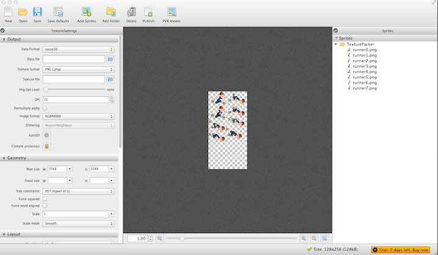
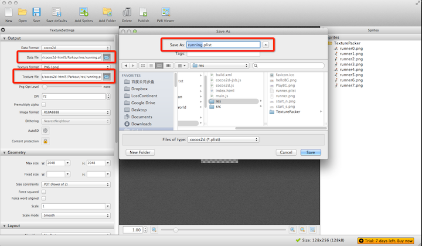
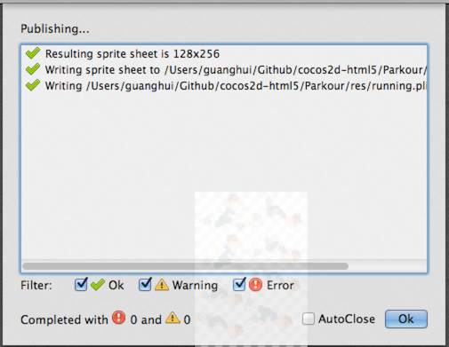
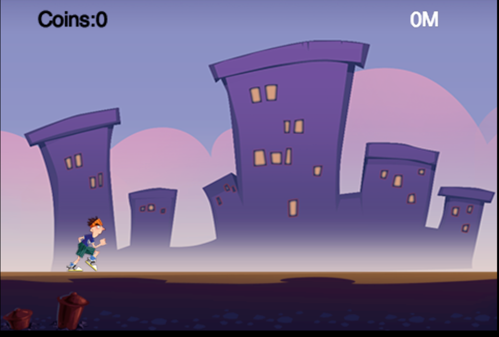

# Let the Player Run Animations

## Introduction

In the last tutorial, we have moved the player from one point to another. But the movement is a little wired. In this tutorial, I will show you
how to run animations on the player. Thus the player's movement will be more realistic.

Before that, I want to show you an awesome tool named *TexturePacker*. 

## Introduction to TexturePacker

TexturePacker is a cross-platform GUI and command line tool to create sprite sheets!
If you want to learn more about TexturePacker, go to [this website](http://www.codeandweb.com/texturepacker/documentation) for more information.

Here I will give you a brief introduction for using TexturePacker to generate the animation files we need in our game.

### Build Your Own Animations with TexturePacker

Here is the building process:

1. Open TexturePacker and drag the folder *TexturePacker* under *res/TexturePacker*  in to TexturePacker's sprite area.



When you add new images into the *TexturePacker* folder, TexturePacker will automatically detect the changes and load the images.

2. Choose "data format" to "cocos2d" and "data format" to "png" from the TextureSettings panel(which is the default settings).

3. Specify the *Data file* and *Texture file* path. Here we set the path at *res* directory and we set the data file name to "running.plist" and the texture file to "running.png".



4. Click *publish*. Now a dialog will appear, if there are no errors, then it will  generate "running.png" and "running.plist" in the right place.



Ok, we have successfully generate the running animation files. Next let's play with the generated animation files.

## Load Animations Files in Cocos2D-HTML5

### Preparation

At first, we should add the running.plist and running.png  to *resource.js* file.

```
var s_HelloBG = "helloBG.png";
var s_start_n = "start_n.png";
var s_start_s = "start_s.png";
var s_PlayBG = "PlayBG.png";
var s_runner = "running.png";
var s_runnerplist = "running.plist";


var g_resources = [
    //image
    {src:s_HelloBG},
    {src:s_start_n},
    {src:s_start_s},
    {src:s_PlayBG},
    {src:s_runner},
    {src:s_runnerplist}
];
```

Here, we have changed the variable *s_runner*'s value to "running.png" which is a spritesheet. We will create our player sprite from the *running.png*
in the future.

### Create Player Animation

At first, we should add the following member variables in *AnimationLayer.js*:

```
spriteSheet:null,
runningAction:null,
sprite:null,
```

Then we should replace the player creation method to:

```
this.sprite = cc.Sprite.createWithSpriteFrameName("runner0.png");
```

We can easily create a animation with the following code:

```
//1.load spritesheet 
 cc.SpriteFrameCache.getInstance().addSpriteFrames(s_runnerplist);

//2.create spriteframe array
var animFrames = [];
for (var i = 0; i < 8; i++) {
    var str = "runner" + i + ".png";
    var frame = cc.SpriteFrameCache.getInstance().getSpriteFrame(str);
    animFrames.push(frame);
}
//3.create a animation with the spriteframe array along with a period time
var animation = cc.Animation.create(animFrames, 0.1);

//4.wrap the animate action with a repeat forever action
this.runningAction = cc.RepeatForever.create(cc.Animate.create(animation));
```

The animation is constructed from a series of small images(from runner0.png to runner7.png) in the spritesheet.

Here is the completely process to create a animation in cocos2d-html5:

1. Load spritesheet plist file into SpriteFrameCache class.
2. Add animation frames to the array *animFrames*
3. Create a cc.Animation object from the animation frame array along with a delay time between each sprite frame.
4. Create the final cc.Animate object and wrap it when a RepeatForever action. Thus the animation will run infinite.

Generally, if we use animations in cocos2d-html5, we always use *SpriteBatchNode* to boost game performance.

The final code of the *AnimationLayer.js* is:

```
var AnimationLayer = cc.Layer.extend({
    spriteSheet:null,
    runningAction:null,
    sprite:null,
    ctor:function () {
        this._super();
        this.init();
    },

    init:function () {
        this._super();

        // create sprite sheet
        cc.SpriteFrameCache.getInstance().addSpriteFrames(s_runnerplist);
        this.spriteSheet = cc.SpriteBatchNode.create(s_runner);
        this.addChild(this.spriteSheet);

        
        // init runningAction
        var animFrames = [];
        for (var i = 0; i < 8; i++) {
            var str = "runner" + i + ".png";
            var frame = cc.SpriteFrameCache.getInstance().getSpriteFrame(str);
            animFrames.push(frame);
        }

        var animation = cc.Animation.create(animFrames, 0.1);
        this.runningAction = cc.RepeatForever.create(cc.Animate.create(animation));
        this.sprite = cc.Sprite.createWithSpriteFrameName("runner0.png");
        this.sprite.setPosition(cc.p(80, 85));
        this.sprite.runAction(this.runningAction);
        this.spriteSheet.addChild(this.sprite);
    }
});
```

Now, you can run the project and you will get a infinite running player in your game screen.



##Summary

In this tutorial, we have learned how to use TexturePacker to generate animation and how to run animation on a sprite within cocos2d-html5.

You can download the entire project from [here](res/Parkour.zip).

## Where to Go from Here?

In the next tutorial, we will add chipmunk physics into our game world. Thus our game will look more realistic.
