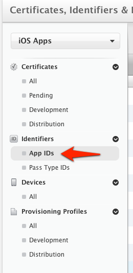
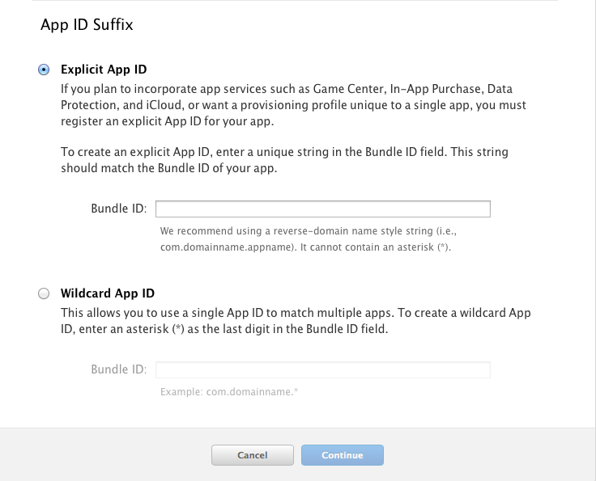
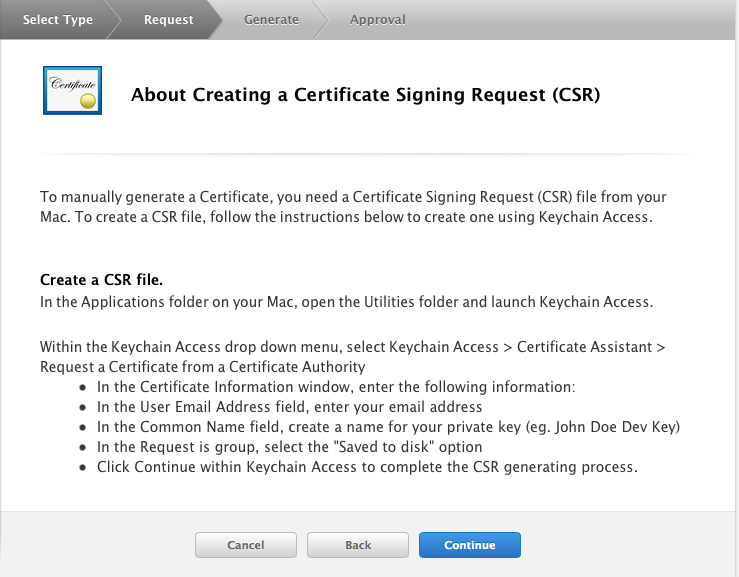
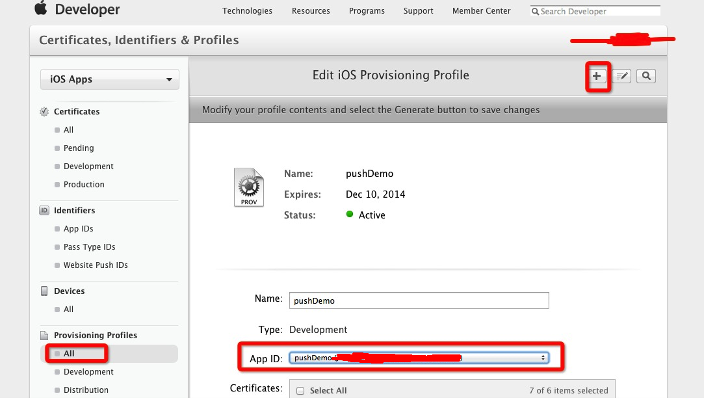
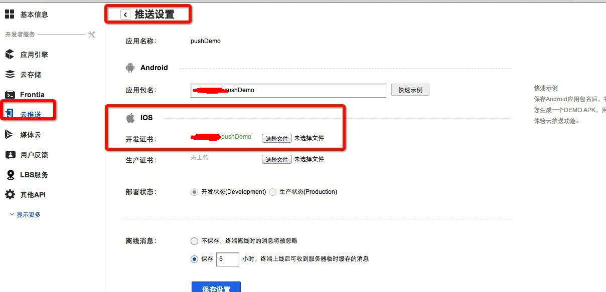
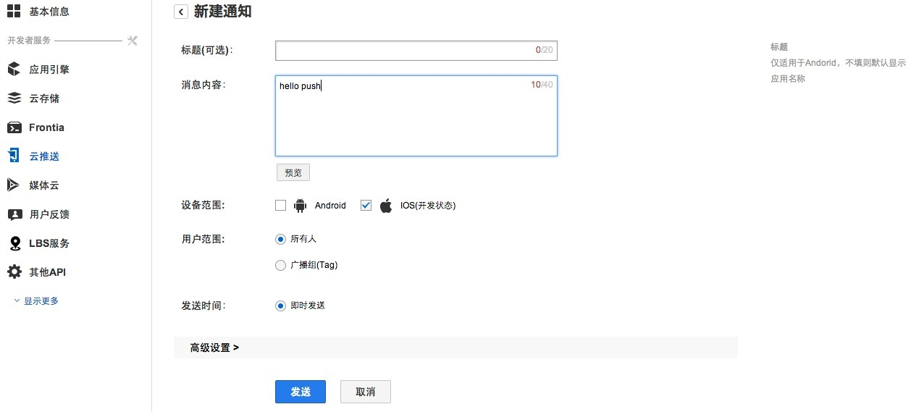
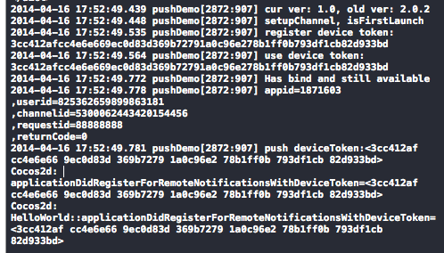
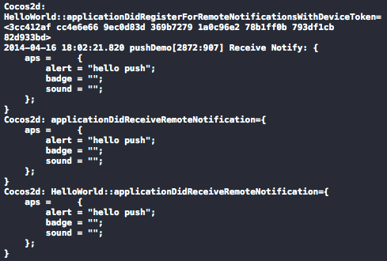

#cocos2d-x iOS集成push

###前言

使用推送消息，可提醒用户，召回玩家。延长游戏的寿命和收益！下面我们就一起来学习，cocos2d-x iOS集成push。

收到push消息：


本文主要内容：

* iOS Push基本理念
* 创建工程
* ios push相关配置
* push集成
* push 测试和使用
* 总结
* 相关资料

### iOS Push基本理念
我们先来了解，iOS push实现的大概原理

  

* 从上图我们可以看到。  
   1. 首先是应用程序注册消息推送。  
   2. IOS跟APNS Server要deviceToken。应用程序接受deviceToken。  
   3. 应用程序将deviceToken发送给PUSH服务端程序。  
   4. 服务端程序向APNS服务发送消息。  
   5. APNS服务将消息发送给iPhone应用程序。  

无论是iPhone客户端跟APNS,还是Provider和APNS都需要通过证书进行连接的
    
### 创建工程

工程基于 cocos2d-x-3.0rc2 版本, 针对ios平台.

[cocos2d-x-3.0rc2 下载地址](http://www.cocos2d-x.org/filedown/cocos2d-x-3.0rc2-cn)
如果已经有cocos2d-x 引擎可以跳过下载。解压文件进入该目录
创建工程

```
    $ cd cocos2d-x
    $ ./setup.py
    $ source FILE_TO_SAVE_SYSTEM_VARIABLE
    $ cocos new pushDemo -p com.your_company.pushDemo -l cpp -d /home
    $ cd /home/pushDemo
```

### push相关配置

* 登陆 [iOS Dev Center](https://developer.apple.com/devcenter/ios/index.action) 选择进入iOS Provisioning Portal。创建应用程序ID
  

* 在 iOS Provisioning Portal中，点击App IDs进入App ID列表。
  


* 创建 App ID，如果 ID 已经存在可以直接跳过此步骤
  


* 为 App 开启 Push Notification 功能。如果是已经创建的 App ID 也可以通过设置开启 Push Notification 功能。
  


* 根据实际情况完善 App ID 信息并提交,注意此处需要指定具体的 Bundle ID 不要使用通配符。
  

* push cer创建 develop 和 production
如果你之前没有创建过 Push 证书或者是要重新创建一个新的，请在证书列表下面新建。
   
新建证书需要注意选择证书种类（开发证书用于开发和调试使用，生产证书用于 App Store 发布）
  


* 点击 Continue 后选择证书对应的应用ID，然后继续会出现“About Creating a Certificate Signing Request (CSR)”。
  

* 根据它的说明创建打开KeychainAccess 创建 Certificate Signing Request。
  


* 填写“User Email Address”和“Common Name” 后选择 Saved to disk 进行保存 。
   
继续返回Apple developer 网站点击 Continue ，上传刚刚生成的 .certSigningRequest 文件生成 APNs Push  Certificate。
下载并双击打开证书，证书打开时会启动“钥匙串访问”工具。
在“钥匙串访问”中你的证书会显示在“我的证书”中，注意选择“My Certificates” 和"login"
  

* 导出 .p12 证书文件
在“钥匙串访问”中，选择刚刚加进来的证书，选择右键菜单中的“导出“...””。
注意要选“login”和“My Certificates” 导出证书时要选中证书文件，不要展开private key。
  
将文件保存为Personal Information Exchange (.p12)格式。
保存p12文件时，可以为其设置密码，也可以让密码为空。

* app Provisioning Profile 创建,选取app Id, Certificates,Devices. 分develop 和 production
   


### push集成
* 新建pushHelper C++类,定义监听push回调相关的接口。

```
class  pushHelper
{    
public:
    /** returns a shared instance of the pushHelper
     *  @js getInstance
     */
    static pushHelper* sharedPushHelper(void);

    /**
     @brief  The function be called when the application launching receive remote notification
     @param  notificationJson the pointer of the notification json string
     */
    bool applicationDidFinishLaunchingWithNotification(const char* notificationJson);
    
    /**
     @brief  The function be called when the application register remote notification success
     @param  deviceToken the pointer of the notification token string
     */
    void applicationDidRegisterForRemoteNotificationsWithDeviceToken(const char *deviceToken);

    /**
     @brief  The function be called when the application register remote notification failed
     @param  error the pointer of the register remote notification failed string
     */
    void applicationdidFailToRegisterForRemoteNotificationsWithError(const char *error);
    
    /**
     @brief  The function be called when the application running receive remote notification
     @param  notificationJson the pointer of the notification json string
     */
    void applicationDidReceiveRemoteNotification(const char* notificationJson);
    
};
```

* 在AppController.mm加入 ios remoteNotification 相关实现

1.在application: didFinishLaunchingWithOptions:注册push的种类，并处理启动时收到push

```
    //======================push========================
    
    [application registerForRemoteNotificationTypes:
     UIRemoteNotificationTypeAlert
     | UIRemoteNotificationTypeBadge
     | UIRemoteNotificationTypeSound];
    
    [application setApplicationIconBadgeNumber:0];
    
    //启动时收到push delay 5s派发
    NSDictionary * userInfo = [launchOptions objectForKey:UIApplicationLaunchOptionsRemoteNotificationKey];
    if(userInfo) {
        [application setApplicationIconBadgeNumber:0];
        NSLog(@"LaunchOptionsRemoteNotification:%@",[userInfo description]);
        
        dispatch_after(dispatch_time(DISPATCH_TIME_NOW, (int64_t)(5 * NSEC_PER_SEC)), dispatch_get_main_queue(), ^{
            pushHelper::sharedPushHelper()->applicationDidFinishLaunchingWithNotification([[userInfo description] cStringUsingEncoding:NSUTF8StringEncoding]);
        });
    }
    
    //======================push========================
```


2.在application: didRegisterForRemoteNotificationsWithDeviceToken:处理收到注册push成功返回的device token：

```
    NSLog(@"push deviceToken:%@",deviceToken);
    
    pushHelper::sharedPushHelper()->applicationDidRegisterForRemoteNotificationsWithDeviceToken([[deviceToken description] cStringUsingEncoding:NSUTF8StringEncoding]);
```

3.在application: didReceiveRemoteNotification: 处理app运行状态下接收到的Push消息：

```
    NSLog(@"Receive Notify: %@", [userInfo description]);
    [application setApplicationIconBadgeNumber:0];

    pushHelper::sharedPushHelper()->applicationDidReceiveRemoteNotification([[userInfo description] cStringUsingEncoding:NSUTF8StringEncoding]);
```

4.在application: didFailToRegisterForRemoteNotificationsWithError:处理注册push失败

```
    pushHelper::sharedPushHelper()->applicationdidFailToRegisterForRemoteNotificationsWithError([[error description] cStringUsingEncoding:NSUTF8StringEncoding]);
```

* 实现pushHelper.cpp

在cocos2dx 3.0的版本中 CCNotificationCenter 被废弃。我们
使用自定义事件进行推送通知派发。

```
bool pushHelper::applicationDidFinishLaunchingWithNotification(const char* notificationJson)
{
    CCLOG("applicationDidFinishLaunchingWithNotification=%s",notificationJson);

    dispatcherNotificationEvent(notificationJson, NOTIFICATION_EVENT);

    return true;
}

void pushHelper::applicationDidRegisterForRemoteNotificationsWithDeviceToken(const char *deviceToken)
{
    CCLOG("applicationDidRegisterForRemoteNotificationsWithDeviceToken=%s",deviceToken);

    dispatcherNotificationEvent(deviceToken, REGISTER_NOTIFICATION_DEVICETOKEN_EVENT);
}

void pushHelper::applicationdidFailToRegisterForRemoteNotificationsWithError(const char *error)
{
    CCLOG("FailToRegisterForRemoteNotificationsWithError=%s",error);

    dispatcherNotificationEvent(error, REGISTER_NOTIFICATION_ERROR_EVENT);
}

void pushHelper::applicationDidReceiveRemoteNotification(const char* notificationJson)
{
    CCLOG("applicationDidReceiveRemoteNotification=%s",notificationJson);

    dispatcherNotificationEvent(notificationJson, NOTIFICATION_EVENT);
}

void pushHelper::dispatcherNotificationEvent(const char* data, const char* notificationEventType)
{
    auto director = Director::getInstance();
    char* buf = new char[256];
    sprintf(buf, "%s", data);
    EventCustom event(notificationEventType);
    event.setUserData(buf);
    director->getEventDispatcher()->dispatchEvent(&event);
    CC_SAFE_DELETE_ARRAY(buf);
}
```


### push测试

push 消息的推送 需要客户端和服务器的支持。  
自己搭建推送服务器(对于没有服务器编程经验的人)比较麻烦。  
现在国内主流的第三方push方案（百度云推送、极光推送、个推）,都提供push集成客户端SDK 和 push消息推送控制台 或 消息推送服务SDK，推送结果统计。根据应用ID注册，消息推送条数 决定收费。开发者可以灵活选择使用。

在此，本demo使用免费百度云推送方案，使用百度云推送的推送控制台测试。

* 集成百度云推送  

	1. 上[百度开发者](http://developer.baidu.com/console#app/project)注册工程  
   

	2. 参照文档完成客户端SDK的集成,加入baidu 云推送 依赖的framework  
	3. 完善工程配置,develop / production选择，上传APNS证书  
  


	4. 使用百度云推送控制台推送push  
  


### push使用

在想使用推送通知消息的地方加入监听推送通知事件的代码：

* 在HelloWorldScene.cpp中监听remoteNotification

```
//listen & handle push message
void HelloWorld::onEnter()
{
    addNotificationListener();
}

void HelloWorld::onExit()
{
    removeNotificationListener();
}

void HelloWorld::addNotificationListener()
{
    notification_listener =  EventListenerCustom::create(NOTIFICATION_EVENT, [=](EventCustom* event){
        char* buf = static_cast<char*>(event->getUserData());
        CCLOG("Notification=%s",buf);
    });
    _eventDispatcher->addEventListenerWithFixedPriority(notification_listener, 1);


    register_notification_deviceToken_listener =  EventListenerCustom::create(REGISTER_NOTIFICATION_DEVICETOKEN_EVENT, [=](EventCustom* event){
        char* buf = static_cast<char*>(event->getUserData());
        CCLOG("register notification deviceToken=%s",buf);
    });
    _eventDispatcher->addEventListenerWithFixedPriority(register_notification_deviceToken_listener, 1);

    
    register_notification_error_listener =  EventListenerCustom::create(REGISTER_NOTIFICATION_ERROR_EVENT, [=](EventCustom* event){
        char* buf = static_cast<char*>(event->getUserData());
        CCLOG("register notification error=%s",buf);
    });
    _eventDispatcher->addEventListenerWithFixedPriority(register_notification_error_listener, 1);

}

void HelloWorld::removeNotificationListener()
{
    _eventDispatcher->removeEventListener(notification_listener);
    _eventDispatcher->removeEventListener(register_notification_deviceToken_listener);
    _eventDispatcher->removeEventListener(register_notification_error_listener);
}
```

* push运行结果  

	1. 获取device Token成功 绑定百度云推送成功  
    

	2. 收到push消息  
  
	3. 系统通知栏显示   


### 后记

本demo 基于3.0 rc2版本实现，但是使用其他版本集成push功能与之类似，没有太大变化。 开发者可以灵活选择。 
push 消息的处理 和 使用第三方推送SDK集成也可以灵活选择。  
 完整资源[下载地址](https://github.com/Yangtb/cocos2dx-pushDemo.git)


###FAQ
1. push 不能获取device Token "未找到aps environment 的权利字串"。  
可能原因:   
没有配置push 证书，App id 没有配置push。
2. push 不能再 模拟器 和 已经越狱的机子上工作
3. 收不到push 的可能原因:  
根据devlop or production 模式选取 对应的APNS push证书配置和profile.  
push 受网络因素影响，请检查网络连接是否畅通。  
push存在一定的延时

### 相关资料

1. [iOS RemoteNotifications Programming Guide](https://developer.apple.com/library/ios/documentation/NetworkingInternet/Conceptual/RemoteNotificationsPG/Introduction.html)
2. [百度云推送](http://developer.baidu.com/wiki/index.php?title=docs/cplat/push/guideios)
3. [极光push](http://docs.jpush.cn/pages/viewpage.action?pageId=2621727)
4. [个推](http://www.igetui.com/?page_id=90)
5. [ios push证书设置](http://docs.jpush.cn/pages/viewpage.action?pageId=1343727)

