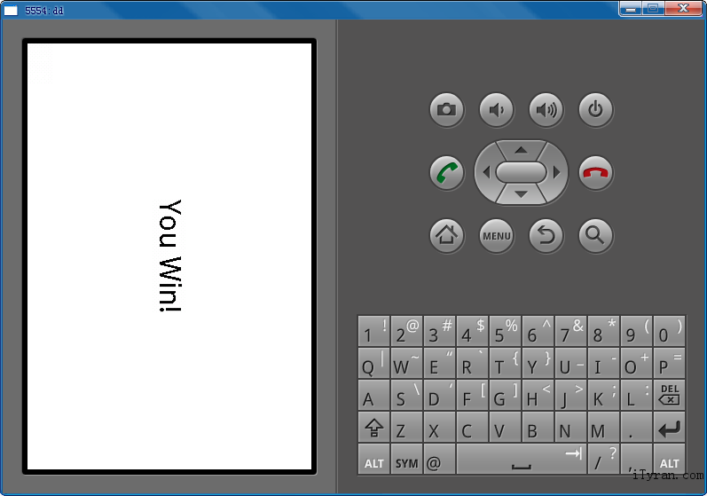
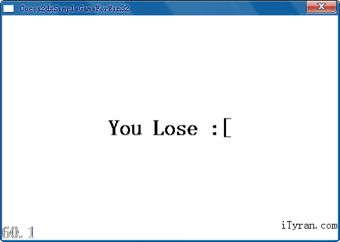

这个简单的游戏基本上已经完成了，但是我们需要添加一些装饰品，使我们的游戏变得更专业。

在本章，我将会添加一个新场景。当一定数量的怪物被击杀，将会在屏幕上显示”You Win”, 如果有一个怪物从左侧离开屏幕，将会显示”You Lose”

现在在Classes目录下新建两个文件: GameOverScene.cpp 和 GameOverScene.h。GameOverScene.h的代码如下:

	#ifndef _GAME_OVER_SCENE_H_
	
	#define _GAME_OVER_SCENE_H_
	 
	#include "cocos2d.h"
	 
	class GameOverLayer : public cocos2d::CCLayerColor
	{
	public:
	    GameOverLayer():_label(NULL) {};
	    virtual ~GameOverLayer();
	    bool init();
	    CREATE_FUNC(GameOverLayer);
	 
	    void gameOverDone();
	 
	    CC_SYNTHESIZE_READONLY(cocos2d::CCLabelTTF*, _label, Label);
	};
	class GameOverScene : public cocos2d::CCScene
	{
	public:
	    GameOverScene():_layer(NULL) {};
	    ~GameOverScene();
	    bool init();
	    CREATE_FUNC(GameOverScene);
	  
	    CC_SYNTHESIZE_READONLY(GameOverLayer*, _layer, Layer);
	};
	 
	#endif // _GAME_OVER_SCENE_H_

OBJC–>C移植小提示:

1. 在Objective-C中类的成员方法可以在头文件没有任何声明的情况下写在.m文件中，但是这在C++中是不合法的，所以bool init(); 在GameOverScene.h里
2. node()方法是一个非常方便开发者使用的api，因为它整合了new init autorelease 等等..但是C++中没有一个类似于objective-c中的self关键字，所以CCLayer::node() 和 CCScene::node() 要被实现在它所派生的类里面. 由于node()的实现是相同的，所以我们构造两个宏来让实现的更容易一些。: LAYER_NODE_FUNC 和SCENE_NODE_FUNC. 为了用这两个宏, init() 要被实现在他们所派生的类里面.
3. 关于构造函数和init(). Cocos2d-x 没有直接移植 objc的init(), 因为 c++ 的构造函数没有返回值, 在这种情况下, 我们只能用try-catch来处理异常, 但是 try-catch 不被android SDK 支持. 所以, cocos2d-x对象初始化分两步, 首先调用构造函数然后用它来初始化init(). 这个方法同样被iOS API设计所采用, 例如, [[NSString alloc] init], Samsung bada 也是这么做的.
4. _label 和 _layer 的setter和getter 被objc的@synthesize所实现, 所以我们实现了一个宏（cocos2dx\include\Cocos2dDefine.h）来模拟@property 和 @synthesize. 综上代码所述, CCX_SYNTHESIZE_READONLY 定义为一个仅有getter的只读成员变量，在c++中，内联函数只能被定义在头文件中In c++,所以 @synthesize自然被实现在头文件中了

之后是 GameOverScene.cpp的代码:

	// cpp with cocos2d-x
	#include "GameOverScene.h"
	#include "HelloWorldScene.h"
	 
	using namespace cocos2d;
	
	bool GameOverScene::init()
	{
		if( CCScene::init() )
		{
			this-&gt;_layer = GameOverLayer::create();
			this-&gt;_layer-&gt;retain();
			this-&gt;addChild(_layer);
			
			return true;
		}
		else
		{
			return false;
		}
	}
	 
	GameOverScene::~GameOverScene()
	{
		if (_layer)
		{
			_layer-&gt;release();
			_layer = NULL;
		}
	}
	 
	bool GameOverLayer::init()
	{
		if ( CCLayerColor::initWithColor( ccc4(255,255,255,255) ) )
		{
			CCSize winSize = CCDirector::sharedDirector()-&gt;getWinSize();
			this-&gt;_label = CCLabelTTF::create("","Artial", 32);
			_label-&gt;retain();
			_label-&gt;setColor( ccc3(0, 0, 0) );
			_label-&gt;setPosition(ccp(winSize.width/2, winSize.height/2));
			this-&gt;addChild(_label);
			
			this-&gt;runAction( CCSequence::create(
	                                CCDelayTime::create(3),
	                                CCCallFunc::create(this, 
	                               callfunc_selector(GameOverLayer::gameOverDone)),
	                                NULL));
			
			return true;
		}
		else
		{
			return false;
		}
	}
	 
	void GameOverLayer::gameOverDone()
	{
	    CCDirector::sharedDirector()-&gt;replaceScene(HelloWorld::scene());
	}
	 
	GameOverLayer::~GameOverLayer()
	{
		if (_label)
		{
			_label-&gt;release();
			_label = NULL;
		}
	}

GameOverScene.cpp中有两个对象, 一个场景一个层。一个场景可以包含许多个层。 在本游戏, 这里只有一个层, 并且在它中心, 一个写着 “You Win” 或 “You Lose” 的label将会显示三秒.

OBJC->C移植小提示:

1. 注意GameOverLayer.label 和 GameOverScene.layer,他们在 objc 是以 @property (nonatomic, retain) 定义的, 他代表着他们被retain过, 所以他们在dealloc中需要被release. 同理, 在GameOverLayer and GameOverScene的init() 的方法中也会被 retain(), 并且在~GameOverLayer()和~GameOverScene()中分别调用release().
2. NSAutoReleasePool 同样被移植入 cocos2d-x. 这个垃圾回收器对c++ 编程有帮助, 而且同样对iOS有效, 更多信息请参考 苹果官方手册

在cocos2d-x, 我们在两个情况需要调用release():

- 这个对象是我们自己new出来的, 例如, CCSprite *sprite = new CCSprite();
- 这个对象由一个静态方法所创建, 例如, CCSprite *sprite = CCSprite::spriteWithFile(…)，在这里, 我们不需要release(), 但是当sprite->retain() 被调用, 则sprite->release()同样也要被调用。

回到教程上来, GameOverScene 在这些情况下被调用:

	// cpp with cocos2d-x
	protected:
	int _projectilesDestroyed;

一定数量的怪兽被杀，或者一只怪兽逃离屏幕。

我们在 HelloWorldScene 添加一个变量来统计英雄杀掉了多少只怪物.

	// cpp with cocos2d-x
	_projectilesDestroyed = 0;

然后在 HelloWorld::HelloWorld() 中初始化,

 
	// cpp with cocos2d-x
	#include "GameOverScene.h"

在位于HelloWorld::update()的targetsToDelete循环中 removeChild(target) 之后添加如下代码来判断是否胜利

	// cpp with cocos2d-x
	_projectilesDestroyed++;                       
	if (_projectilesDestroyed &gt;= 5)
	{
	  GameOverScene *gameOverScene = GameOverScene::create();
	  gameOverScene-&gt;getLayer()-&gt;getLabel()-&gt;setString("You Win!");
	  CCDirector::sharedDirector()-&gt;replaceScene(gameOverScene);
	}

在spriteMoveFinished()的“if (sprite->getTag() == 1)”分支下 添加如下代码，来判断是否失败,

	// cpp with cocos2d-x
	GameOverScene *gameOverScene = GameOverScene::create();
	gameOverScene-&gt;getLayer()-&gt;getLabel()-&gt;setString("You Lose :[");
	CCDirector::sharedDirector()-&gt;replaceScene(gameOverScene);

现在，一切就绪，编译运行，所以效果都讲被显示出来，到处都是怪兽，到处都是子弹，激烈的背景音乐，和一个当你胜利或失败的提示

全部任务完成，干杯！

Phone 

 android 

 win32 

